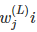
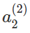
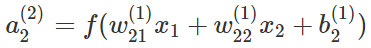

# Optical Character Recognition (OCR)


这是[开源程序架构](http://aosabook.org/en/index.html)系列的第四本[《500 Lines or Less》](https://github.com/aosabook/500lines/blob/master/README.md)的早期章节。
如果你发现任何问题，可以在我们的[Github Issues](https://github.com/aosabook/500lines/issues)上反馈。
请关注[AOSA blog](http://aosabook.org/blog/)获取最新的章节及出版计划，还可以在[这个推特](https://twitter.com/aosabook)上获取关于本书的最新消息。

----
## 简介

要是你的电脑能帮你洗盘子，洗衣服，做饭，收拾房间那会是怎样一番景象呢？
我敢肯定，大多数人会很喜欢这样的一个得力助手！
但是，计算机如何才能准确的像人一样,按照人完成这些工作的方式，完成这些任务呢？

著名的计算机科学家艾伦·图灵提出了图灵测试。
这是一种可以判断一台机器的智能程度是否已经与人类匹敌的测试。
图灵测试需要一个处在明处提问者，两个处在暗处的未知实体（一个是人,一个是机器）。
提问者需要提出问题并试图通过未知实体的回答来分辨出哪一个是人，哪一个是机器。
如果提问者是无法辨别机器和人类，那么说明被测试的机器已经具有了与人类相仿水平的智能。

虽然关于‘图灵测试’的有效性以及人们能否创造出这种水平的智能一直有着很多争议，
但是毋庸置疑的是现在已经存在了一些具有不俗智能的机器。
如今一些软件已经可以操控机器人完成简单的办公任务，或者帮助那些爱滋海默症（老年痴呆）的患者。
还有一些人工智能更加常见，像谷歌的搜索引擎以及Facebook的热点推荐系统等等。 

一个比较普遍的人工智能的应用是光学字符识别（OCR）。
OCR系统可以识别手写的文字，并且将其转换成机器可以处理的字符。
当你将一个手写支票导入银行设备中验证存款金额时，你有考虑过这些神奇的功能到底是怎么实现的吗?
本章将带你了解一个基于智能神经网络的（ANN）的数字识别OCR系统是如何运作的。

在开始一切工作之前，我们还要明确一些背景知识。

## 什么是人工智能

尽管图灵先生关于智能的定义看起来很合理，但是关于智能的构成，归根结底是一种哲学层面的思索。
计算机科学家们已经（怎么分的不重要）将一些系统和算法分类到人工智能的某些分支当中。
关于这些分类，我们举几个例子（当然还有[更多](http://www-formal.stanford.edu/jmc/whatisai/node2.html)）：

* 根据真实世界已知信息进行的概率性演绎推理。例如：模糊推论法可以帮助恒温器在感知到空气温热潮湿时做出打开空调的决定；
* 启发式搜索。例如：在下棋时可以通过搜索所有可能的来选择出获益最高的走法；
* 反馈的机器学习模型。例如：一些模式识别问题，像OCR。

总之，机器学习就是使用大量数据进行模式识别系统的训练。
用于训练的数据集可能有两种：一种是示踪的，是说根据输入限定系统的期望输出,也就是对于某种输入有人为的期望结果；
一种是非示踪的，也就是说对系统的期望输出没有限制。
使用非示踪数据集的算法被称作非监督式算法，使用示踪数据集的算法则被称作监督式算法。
可以用来实现OCR的机器学习算法核技术有很多，今天我们所用ANNs就是其中一种很简单的方法。

## 人工神经网络（ANNs）

### <span id='what-are-anns'>什么是ANNs</span>
人工神经网络（ANNs）是一种由很多相互连通且可以互相通讯的节点组成的网络结构。
这种结构和功能是受到了生物脑结构的启发。
[赫布理论](http://www.nbb.cornell.edu/neurobio/linster/BioNB420/hebb.pdf)解释了生物体内的这些神经网络是如何通过改变物理层面的结构和连接强度来进行模式识别的学习的。
同样的，一个典型的ANN（如图13.1所示）的节点之间具有一些会根据网络的学习不断改变权值的连接（边）。
我们称节点标记+1为偏移。
最左边蓝色的一列节点是输入节点，中间一行包含很多隐藏节点，最右边的是输出节点。
中间包含很多隐藏节点的这一列，通常别叫作“隐藏层”。


在图13.1中所有节点圆圈中的数字代表节点的输出。如果我们称第L层第n个节点的输出为n(L),第L层第i个节点与第L+1层第j个节点的链接称为。那么，的输出为：



其中，f()是激活函数，b是偏移量。激活函数决定着节点输出的类型。偏移量是一个用于提高神经网络精确性的加性节点。更多有关上述二者的细节可以参看[设计一个前馈神经网络](http://aosabook.org/en/500L/optical-character-recognition-ocr.html#sec.ocr.feedforward)

这类没有循环的神经网络我们称之为‘前馈’神经网络。节点的输出反馈回输入端的人工神经网络被则称为周期神经网络。有很多可以用于训练前馈神经网络的算法,*反向传播*就是其中比较常用的之一。在本章的OCR系统中就将使用反向传播的方式实现神经网络的。


### 怎么使用ANNs

和其他机器语言方法一样，使用反向传播的第一步就是将我们的问题化简。我们需要思考如何让我们的问题化简为一个可以用ANN解决的问题。具体一点,我们需要决定如何将我们的数据变换处理成能够输入到ANN之中的状态。对于这次要实现的OCR系统来说，我们可以将给定*数字的图片*中像素的位置作为输入。这种思路看起来非常直白简单，但是更多时候选择输入的格式并不会像这样简单。举个例子，如果我们想在一些比较大的图像中进行形状的识别，我们可能需要先对图像进行预处理来识别其中物体的大概轮廓，然后再将这个识别出的轮廓作为输入数据。

一旦我们决定了输入数据的格式，接下来要做些什么呢？就像我们在<a href=#what-are-anns>什么是人工神经网络</a>小节中所讲的，因为反向传播是一种监督算法，所以他需要使用被标记的数据进行训练。因此，当我们使用像素的位置作为训练输入时，同时也要将其所代表的的数字也如输入其中。这意味着我们需要收集大量的包含数字图像及其所代表的数字的数据对。

下一步是将数据分成训练组及校验组。训练组的数据用于驱动反向传播算法设置ANN的节点权值。校验组的数据有两个作用，一是用于校验经过训练组数据训练后的ANN的输出结果，二是评估算法性能（准确性）。如果我们打算比较反向传播算法与其他类似算法在处理我们的数据时的性能，我们可以分出50%的数据作为训练组，25%用于比较两种算法的性能（校验组），剩余25%用于测试最终选取的算法的准确性（测试组）。如果我们不打算实验多种算法，那我们可以把25%用于比较算法性能的数据分到训练组中，剩余的25%作为校验组检测ANN最终被训练的如何。

评估ANN的准确性有着双重的目的。首先，评估ANN的准确性可以避免过拟合。所谓过拟合就是指，训练出来网络对训练组数据的识别准确性远高于对校验组的识别准确性。当出现过拟合状态时，说明我们选取的训练数据不够有代表性，比较片面。这时，我们需要重新提炼训练用的数据。另外，通过评估不同隐藏层及隐藏节点的ANN，可以帮助我们确定最佳的ANN规模。合适的ANN规模是指，在保证识别率的情况下使用最少的节点/连接，以此来减小计算开支，加快训练及识别的效率。一旦确定了合适的ANN规模并完成训练，我们的ANN就准备好进行识别预测了。

## 在一个简单的OCR系统中设计决策方案
刚刚我们了解了一下基础的前馈神经网络,以及如何使用它们。接下来我们将一起探索一下如何搭建一个OCR系统。

首先,我们必须明确我们的系统能够实现什么功能。简单来讲,当我的用户手写了一个数字作为输入时,我们的系统可以利用这个图片进行训练或者根据图片识别出其中数字。
虽然我们的OCR系统可以在单机运行,那但是创建一个客户端-服务器的框架会比较灵活。使用服务器我们可以利用网络社群的数据训练我们的神经网,同时也可以将复杂密集的运算交给性能更加强劲的服务器。

我们的OCR系统主要由5部分组成,分别写在5个文件之中。它们分别是:

* 客户端(ocr.js)

* 服务器(server.py)

* 简单的用户界面(ocr.html)

* 基于反向传播训练的ANN(ocr.py)

* ANN的实现脚本(neural_network_design.py)

我们的用户界面非常简单:一个可以在其中绘制数字的画板,和一个可以切换训练还是识别的按钮。
客户端将会收集用户在用户界面绘制的数字图像,将其转换为一个数组,并将数组结合'训练/识别'指令传递给服务器。服务器简单的按照指令生成ANN模块的API请求。
ANN模块在第一次初始化时,会利用已有的数据进行训练,并将训练后的权值存在一个文件中。在之后再次调用ANN模块时,ANN模块会自动读取权值文件来恢复之前的训练状态。
这个模块包含训练及识别的核心逻辑运算。最后,设计一个通过实验不同的隐藏节点数量寻求最佳性能的决策脚本。将上述的这些模块组合在一起,我们就可以实现一个简单但却强大的OCR系统了。

这样一来我们,我们的基本设计思路就很清晰了。接下来,让我们动起手来将思想转化为代码。

### 简单的界面(orc.html)

我们在前文中已经讲到,首先我们需要收集一些用于训练ANN的数据。我们可以上传一系列手写的数字的图片到服务器中,但是这样做非常的麻烦。
比较好的替代方案就是,直接让用户在HTML的画布(Canvas)元素中绘制数字。我们可以给用户一个用于选择'训练/识别'的按钮。如果选择了训练,用户还需要将绘制的图片所代表的数字一并提交。
下面是我们的HTML代码:

    <html>
    <head>
        <script src="ocr.js"></script>
        <link rel="stylesheet" type="text/css" href="ocr.css">
    </head>
    <body onload="ocrDemo.onLoadFunction()">
        <div id="main-container" style="text-align: center;">
            <h1>OCR Demo</h1>
            <canvas id="canvas" width="200" height="200"></canvas>
            <form name="input">
                <p>Digit: <input id="digit" type="text"> </p>
                <input type="button" value="Train" onclick="ocrDemo.train()">
                <input type="button" value="Test" onclick="ocrDemo.test()">
                <input type="button" value="Reset" onclick="ocrDemo.resetCanvas();"/>
            </form> 
        </div>
    </body>
    </html>

### OCR客户端(ocr.js)

网页中的一个像素非常的难看清,所以我们可以用一个10x10真实像素的方块代表我们识别中的一个像素单位。这样一个200x200的画布(Canvas)对我们的ANN来说就相当于一个20x20的画布(Canvas)了。

    var ocrDemo = {
    CANVAS_WIDTH: 200,
    TRANSLATED_WIDTH: 20,
    PIXEL_WIDTH: 10, // TRANSLATED_WIDTH = CANVAS_WIDTH / PIXEL_WIDTH
    
为了看上去更清楚,我们可以为我们的像素单位填充一些颜色。我们使用`drawGrid()`方法来生成蓝色的网格。

    drawGrid: function(ctx) {
        for (var x = this.PIXEL_WIDTH, y = this.PIXEL_WIDTH; 
                 x < this.CANVAS_WIDTH; x += this.PIXEL_WIDTH, 
                 y += this.PIXEL_WIDTH) {
            ctx.strokeStyle = this.BLUE;
            ctx.beginPath();
            ctx.moveTo(x, 0);
            ctx.lineTo(x, this.CANVAS_WIDTH);
            ctx.stroke();

            ctx.beginPath();
            ctx.moveTo(0, y);
            ctx.lineTo(this.CANVAS_WIDTH, y);
            ctx.stroke();
        }
    },
    
我们需要将我们收集到的图像数据处理成能传递到服务器的格式。我们用0代表黑色像素,1代表白色像素,将数据储存在一个叫`data`的数组中。我们还需要监听鼠标在画布上的运动,来触发`fillSquare()`方法。`fillSquare()`方法可以将用户选中的像素上色。利用一些简单的运算,我们就能够将用户鼠标的绘制轨迹转化为我们画布中的像素信息了。

    onMouseMove: function(e, ctx, canvas) {
        if (!canvas.isDrawing) {
            return;
        }
        this.fillSquare(ctx, 
            e.clientX - canvas.offsetLeft, e.clientY - canvas.offsetTop);
    },

    onMouseDown: function(e, ctx, canvas) {
        canvas.isDrawing = true;
        this.fillSquare(ctx, 
            e.clientX - canvas.offsetLeft, e.clientY - canvas.offsetTop);
    },

    onMouseUp: function(e) {
        canvas.isDrawing = false;
    },

    fillSquare: function(ctx, x, y) {
        var xPixel = Math.floor(x / this.PIXEL_WIDTH);
        var yPixel = Math.floor(y / this.PIXEL_WIDTH);
        this.data[((xPixel - 1)  * this.TRANSLATED_WIDTH + yPixel) - 1] = 1;

        ctx.fillStyle = '#ffffff';
        ctx.fillRect(xPixel * this.PIXEL_WIDTH, yPixel * this.PIXEL_WIDTH, 
            this.PIXEL_WIDTH, this.PIXEL_WIDTH);
    },
    
现在,我们离目标越来越近了!接下来,我们需要一个对传输到服务器的训练数据进行处理的函数。就像下面这个`train()`函数。它会对数据进行错误排查,之后将数据写入`trainArray`中,最后通过调用`sendData()`函数将数据发送给服务器。
```javascript
    train: function() {
        var digitVal = document.getElementById("digit").value;
        if (!digitVal || this.data.indexOf(1) < 0) {
            alert("Please type and draw a digit value in order to train the network");
            return;
        }
        this.trainArray.push({"y0": this.data, "label": parseInt(digitVal)});
        this.trainingRequestCount++;

        // Time to send a training batch to the server.
        if (this.trainingRequestCount == this.BATCH_SIZE) {
            alert("Sending training data to server...");
            var json = {
                trainArray: this.trainArray,
                train: true
            };

            this.sendData(json);
            this.trainingRequestCount = 0;
            this.trainArray = [];
        }
    },
```

这里有一个值得一提的有趣设计,就是`trainingRequestCount`, `trainArray`, 和`BATCH_SIZE`的使用。
为什么这么讲呢,`BATCH_SIZE`是一个预定义的常量,用于限定客户端在一次性将成批的数据传递至服务期之前的最大缓存容量。
这样设计的主要原因是为了避免大量请求对服务器造成过大的压力。

如果存在许多客户端（例如，许多用户在`ocr.html`页面训练系统），或者如果客户端中存在另一个层，它接收扫描的绘制数字并将它们转换为像素以训练网络，则“BATCH_SIZE”为1将导致许多不必要的请求。 这种方法为客户端带来了灵活性，然而，在实践中存在需要时，服务端也需要执行批处理。 因为服务端可能会遭到DoS攻击，其中恶意客户端有意地向服务器发送许多请求以淹没它，就会使得它崩溃。

我们还需要一个test（）函数。与train（）类似，它应该对数据的有效性进行简单检查并将其发送出去。 然而，对于test（），不需要批处理，因为用户请求预测时应该会得到一个即时的结果。

```javascript
    test: function() {
        if (this.data.indexOf(1) < 0) {
            alert("Please draw a digit in order to test the network");
            return;
        }
        var json = {
            image: this.data,
            predict: true
        };
        this.sendData(json);
    },
```

最后，我们将需要一些函数来进行HTTP POST请求，接收响应，并在处理任何可能的错误。

```javascript
    receiveResponse: function(xmlHttp) {
        if (xmlHttp.status != 200) {
            alert("Server returned status " + xmlHttp.status);
            return;
        }
        var responseJSON = JSON.parse(xmlHttp.responseText);
        if (xmlHttp.responseText && responseJSON.type == "test") {
            alert("The neural network predicts you wrote a \'" 
                   + responseJSON.result + '\'');
        }
    },

    onError: function(e) {
        alert("Error occurred while connecting to server: " + e.target.statusText);
    },

    sendData: function(json) {
        var xmlHttp = new XMLHttpRequest();
        xmlHttp.open('POST', this.HOST + ":" + this.PORT, false);
        xmlHttp.onload = function() { this.receiveResponse(xmlHttp); }.bind(this);
        xmlHttp.onerror = function() { this.onError(xmlHttp) }.bind(this);
        var msg = JSON.stringify(json);
        xmlHttp.setRequestHeader('Content-length', msg.length);
        xmlHttp.setRequestHeader("Connection", "close");
        xmlHttp.send(msg);
    }
```

### 服务端 (`server.py`)

尽管这只是一个中继信息的小型服务器，但是我们仍然需要考虑如何接收和处理HTTP请求。 首先，我们需要决定使用什么样的HTTP请求。 在最后一节中，客户端使用的是POST请求，但是为什么我们决定使用POST呢？由于数据被发送到服务器，PUT或POST请求是最合适的。我们只需要发送一个不带任何URL参数的json包。所以在理论上，GET请求也能满足我们的需求，但在语义上这样却是没有意义的。在程序员之间长期以来一直有着关于选择PUT和POST的争论;对于这个问题KNPLabs有一个非常有[趣的总结](https://knpuniversity.com/screencast/rest/put-versus-post)。

另一个需要考虑的问题是将“训练”和“预测”请求发送到不同端点（例如`http://localhost/train`和`http://localhost/predict`），还是发送到同一端点进行处理。在这种情况下，我们可以使用后一种方法，因为训练和预测对数据执行的操作之间的差别很小，所以一个简单的if语句就可以非常完美的适应不同的情况。在实践中，如果服务器对每个请求类型进行的处理有很大的差别，那么最好将它们作为单独的端点。这个决定，同时影响着如何设计网页返回的错误信息。例如，当在有效载荷中既没有指定“train”或“predict”时，返回400“错误请求”错误。但是如果使用单独的端点，就不会有这样的问题。如果OCR系统在后台执行的处理由于任何原因而失败，或者服务器没有正确处理发送的信息，则返回500“内部服务器错误”。同样，如果端点是分开的，则将有更多的空间来详细地发送更适当的错误。例如，确定内部服务器错误实际上是由错误请求引起的等等。

最后，我们需要决定什么时候在哪里初始化OCR系统。在server.py中服务器启动之前进行初始化是一个不错的方法。因为在第一次运行时，OCR系统需要在对某些预插入的的数据进行网络训练，这可能需要几分钟。如果服务器在此处理完成之前启动，则任何训练或预测的请求都会抛出异常，因为在这种情况的情况下，OCR对象尚未被初始化。当然还有另一种实现方式，预先产生一些不准确的初始ANN用于前几个查询，同时在后台不断的异步的训练ANN。这种替代方法允许立即使用ANN，但是实现更复杂，并且如果服务器被重置，它将仅在服务器启动时及时保存。这种类型的实现对于需要高可用性的OCR服务将更有益。

这里我们的服务器主要的代码是在一个小巧的函数中处理POST请求。

```python
    def do_POST(s):
        response_code = 200
        response = ""
        var_len = int(s.headers.get('Content-Length'))
        content = s.rfile.read(var_len);
        payload = json.loads(content);

        if payload.get('train'):
            nn.train(payload['trainArray'])
            nn.save()
        elif payload.get('predict'):
            try:
                response = {
                    "type":"test", 
                    "result":nn.predict(str(payload['image']))
                }
            except:
                response_code = 500
        else:
            response_code = 400

        s.send_response(response_code)
        s.send_header("Content-type", "application/json")
        s.send_header("Access-Control-Allow-Origin", "*")
        s.end_headers()
        if response:
            s.wfile.write(json.dumps(response))
        return
```

### 设计前馈式神经网络 (`neural_network_design.py`)
\label{sec.ocr.feedforward}
在设计前馈ANN时，我们需要先考虑一些因素。第一是使用什么激活函数。我们之前提到激活函数是节点输出的决策者。激活函数的决策的类型将帮助我们决定使用哪一个。在我们的例子中，我们将设计一个ANN，为每个数字（0-9）输出一个介于0和1之间的值。值越接近1意味着ANN预测这是绘制的数字，值越接近0意味着它被预测不是绘制的数字。因此，我们想要一个输出接近0或接近1的激活函数。我们还需要一个可微分的函数，因为我们将需要导数用于反向传播计算。在这种情况下常用的函数是S形，因为它满足这两个约束。 StatSoft提供了一个很好的[常用激活函数及其属性列表](http://www.fmi.uni-sofia.bg/fmi/statist/education/textbook/eng/glosa.html)。

另一个要考虑的因素是我们是否想包含偏移因子。我们之前提到过几次偏移因子，但没有真正讲他们是什么或为什么我们使用它们。让我们尝试通过回到描述如何计算节点的输出的图15.1来理解这一点。假设我们有一个输入节点和一个输出节点，我们的输出公式将是$ y = f（wx）$，其中$ y $是输出，$ f（）$是激活函数，$ w $是节点之间链路的权重，$ x $是节点的变量输入。偏差本质上是一个节点，其输出总是$ 1 $。这将改变输出公式为$ y = f（wx + b）$其中$ b $是偏置节点和下一个节点之间的连接的权重。如果我们将$ w $和$ b $视为常量，将$ x $视为一个变量，那么添加一个偏差将一个常数添加到$ f（。）$的线性函数输入。

因此，添加偏移因子可以形成$ y $ 在截距范围的移位。所以通常来讲，节点输出会更加灵活性。添加一个偏移因子是一个非常常见的优化方案，特别是对于具有较少少量输入和输出的ANN。偏移因子会给ANN的输出带来更多灵活性，因此也可以为ANN提供更多的精度空间。没有偏移因子，我们不太可能使用我们的ANN进行正确的预测，或者我们会需要更多的隐藏节点来做出更准确的预测。

要考虑的其他因素还包括隐藏层的数量和每层的隐藏节点的数量。对于具有许多输入和输出的较大ANN，这些数字是通过尝试不同的值并测试网络的性能来决定的。在这种情况下，通过训练给定大小的ANN并观察验证集合的正确分类的百分比来测量性能。在大多数情况下，单个隐藏层对于正常的性能就够了，因此我们在这里只试验隐藏节点的数量。

```python
# Try various number of hidden nodes and see what performs best
for i in xrange(5, 50, 5):
    nn = OCRNeuralNetwork(i, data_matrix, data_labels, train_indices, False)
    performance = str(test(data_matrix, data_labels, test_indices, nn))
    print "{i} Hidden Nodes: {val}".format(i=i, val=performance)
```

这里我们初始化一个ANN，隐藏节点的数量在5-50个中间，每次实验的步幅是5个。然后我们调用test（）函数来进行测试。

```python
def test(data_matrix, data_labels, test_indices, nn):
    avg_sum = 0
    for j in xrange(100):
        correct_guess_count = 0
        for i in test_indices:
            test = data_matrix[i]
            prediction = nn.predict(test)
            if data_labels[i] == prediction:
                correct_guess_count += 1

        avg_sum += (correct_guess_count / float(len(test_indices)))
    return avg_sum / 100
```

内部循环正在计数正确分类的数量，然后除以结束时尝试分类的总数。这样我们就会得到ANN的正确比率或百分比精度。因为每次训练ANN时，其权重可能略有不同，所以我们在外部循环中重复该过程100次，以便我们可以取这个特定ANN配置的准确性的平均值。在我们的示例中，neural_network_design.py的示例运行如下所示：

```
PERFORMANCE
-----------
5 Hidden Nodes: 0.7792
10 Hidden Nodes: 0.8704
15 Hidden Nodes: 0.8808
20 Hidden Nodes: 0.8864
25 Hidden Nodes: 0.8808
30 Hidden Nodes: 0.888
35 Hidden Nodes: 0.8904
40 Hidden Nodes: 0.8896
45 Hidden Nodes: 0.8928
```

从这个输出，我们可以得出结论，15个隐藏节点是最优的。从10到15添加5个节点使我们的准确度提高〜1％，而将精度提高另一个1％将需要添加另外20个节点。增加隐藏节点计数也增加了计算开销。这将需要训隐藏节点网络并进行预测的时间会很长。因此，我们选择使用最后一个隐藏节点的数量，会带来准确性的急剧增加。当然，当设计一个ANN时，计算开销并不是一个很大的问题，并且使ANN拥有更高的准确性是我们优先级最高的工作。所以，在这种情况下，我们最好的选择使45个隐藏节点，而不是15个。

### OCR核心功能

在本节中，我们将讨论如何通过反向传播进行实际训练，如何使用网络进行预测，以及其他有关决策的核心功能的一些关键设计。

#### 通过反向传播进行训练 (`ocr.py`)

我们使用反向传播算法来训练我们的ANN。它需要对训练集中的每个样本重复包括4个主要步骤来更新ANN权重。

首先，我们将权重初始化为小（-1和1）之间的随机值。在我们的例子中，我们将它们初始化为-0.06和0.06之间的值，并将它们存储在矩阵`theta1`，`theta2`，`input_layer_bias`和`hidden_​​layer_bias`中。由于一个层中的每个节点链接到下一层中的每个节点，我们可以创建具有m行和n列的矩阵，其中n是一个层中的节点数量，m是相邻层中的节点数量。该矩阵将表示这两个层之间的链路的所有权重。这里`theta1`为我们的20x20像素输入共400列，`num_hidden_​​nodes`行。同样，`theta2`表示隐藏层和输出层之间的链接。它有`num_hidden_​​nodes`列和`NUM_DIGITS（10）`行。其他两个向量（1行），`input_layer_bias`和`hidden_​​layer_bias`表示偏差。

```python
    def _rand_initialize_weights(self, size_in, size_out):
        return [((x * 0.12) - 0.06) for x in np.random.rand(size_out, size_in)]
```

```python
            self.theta1 = self._rand_initialize_weights(400, num_hidden_nodes)
            self.theta2 = self._rand_initialize_weights(num_hidden_nodes, 10)
            self.input_layer_bias = self._rand_initialize_weights(1, 
                                                                  num_hidden_nodes)
            self.hidden_layer_bias = self._rand_initialize_weights(1, 10)

```

第二步是前向传播，其本质上是如[什么是anns](#什么是anns)中所描述的那样从输入节点开始逐层地计算的节点输出。这里，`y0`是我们希望用来训练ANN的大小为400的数组输入。我们将`θ1`乘以`y0`转置，使得我们有两个大小为（`num_hidden_​​nodes×400）*（400×1）`的矩阵，并且具有对于大小为`num_hidden_​​nodes`的隐藏层的输出的结果向量。然后，我们添加偏差向量，并应用矢量化S形激活函数得到一个输出向量`y1`。 `y1`是我们隐藏层的输出向量。再次重复相同的过程以计算输出节点的`y2`。 `y2`现在是我们的输出层向量，其值表示它们的索引是绘制数字的可能性。例如，如果有人绘制一个8，如果ANN做出正确的预测，则在第8个索引处的`y2`的值将是最大的。然而，6可能具有比为所绘制的数字的1更高的似然性，因为其看起来更类似于8，并且和8也有着更多重叠得像素.`y2`随着很多用于训练的绘制的数字,ANN将会变得更准确。

```python
    # The sigmoid activation function. Operates on scalars.
    def _sigmoid_scalar(self, z):
        return 1 / (1 + math.e ** -z)
```

```python
            y1 = np.dot(np.mat(self.theta1), np.mat(data['y0']).T)
            sum1 =  y1 + np.mat(self.input_layer_bias) # Add the bias
            y1 = self.sigmoid(sum1)

            y2 = np.dot(np.array(self.theta2), y1)
            y2 = np.add(y2, self.hidden_layer_bias) # Add the bias
            y2 = self.sigmoid(y2)
```

第三步是反向传播，其涉及计算输出节点处的错误，然后在每个中间层返回到输入。这里我们首先创建一个期望的输出向量`actual_vals`，在表示绘制数字的值的数字的索引为1，否则为0。输出节点处的误差向量`output_errors`通过从`actual_vals`中减去实际输出向量`y2`来计算。对于每个隐藏层之后，我们计算两个组件。首先，我们有下一层的转置权重矩阵乘以其输出误差。然后我们得到应用于上一层的激活函数的导数。然后，我们对这两个分量执行元素级乘法，得到隐藏层的误差向量。这里我们称之为`hidden_​​errors`。

```python
            actual_vals = [0] * 10 
            actual_vals[data['label']] = 1
            output_errors = np.mat(actual_vals).T - np.mat(y2)
            hidden_errors = np.multiply(np.dot(np.mat(self.theta2).T, output_errors), 
                                        self.sigmoid_prime(sum1))
```

基于先前计算的误差得到的权重更新，调整ANN权重。通过矩阵乘法在每一层更新权重。每层的误差矩阵乘以前一层的输出矩阵。然后将该乘积乘以称为学习速率的标量，并将其加到权重矩阵。学习速率是在0和1之间的值，其影响ANN中的学习的速度和准确性。较大的学习速率值将生成快速学习但不太准确的ANN，而较小的值将生成学习速度较慢但是更准确的ANN。在我们的例子中，我们有一个相对较小的学习率，0.1。因为我们没有为了使用户进行训练或预测请求而立即完成对ANN的训练的需求，所以这样的学习率很不错。这样我们就可以通过简单地将学习速率乘以层的误差向量来更新偏差。

```python
            self.theta1 += self.LEARNING_RATE * np.dot(np.mat(hidden_errors), 
                                                       np.mat(data['y0']))
            self.theta2 += self.LEARNING_RATE * np.dot(np.mat(output_errors), 
                                                       np.mat(y1).T)
            self.hidden_layer_bias += self.LEARNING_RATE * output_errors
            self.input_layer_bias += self.LEARNING_RATE * hidden_errors
```

#### 测试经过了训练的网络 (`ocr.py`)

一旦ANN通过反向传播进行了训练，使用它进行预测就是相当便捷的了。在这里我们可以看到的，如我们在反向传播的步骤2中所做的那样，我们计算了ANN的输出`y2`。然后我们在向量中寻找具有最大值的索引。该指数是ANN预测的数字。

```
    def predict(self, test):
        y1 = np.dot(np.mat(self.theta1), np.mat(test).T)
        y1 =  y1 + np.mat(self.input_layer_bias) # Add the bias
        y1 = self.sigmoid(y1)

        y2 = np.dot(np.array(self.theta2), y1)
        y2 = np.add(y2, self.hidden_layer_bias) # Add the bias
        y2 = self.sigmoid(y2)

        results = y2.T.tolist()[0]
        return results.index(max(results))
```

#### 设计中的一些其他设计 (`ocr.py`)
我们可以在线获取很多详细介绍反向传播的实现的许多资源。来自[威拉米特大学的一门课程](http://www.willamette.edu/~gorr/classes/cs449/backprop.html)就是一个非常不错的资源。它讨论了反向传播的步骤，然后又解释如何将其转换为矩阵形式。虽然使用矩阵的计算量与使用循环的计算量相同，但其优点是代码更简单，并且更易于使用更少的嵌套循环进行读取。正如我们所看到的，整个训练过程是使用矩阵代数在25行代码下编写的。

正如在[在一个简单的ocr系统中设计决策方案](#在一个简单的ocr系统中设计决策方案)中提到的，保存ANN的权重可以确保当服务器关闭或由于任何原因突然崩溃时，我们不会失去之前的训练状态。我们通过JSON文件来保存这些权重。在启动时，OCR将ANN之前保存权重加载到内存。保存功能不是由OCR在内部调用，而是由服务器决定何时执行保存。在我们的例子中，服务器在每次更新后保存权重。这是一个快速和简单的解决方案，但它不是最佳的，因为写入磁盘是耗时的。这也防止我们处理多个并发请求，因为没有机制阻止对同一文件的同时写入。在更复杂的服务器中，可以在关闭时或者每隔几分钟进行一次保存，使用某种形式的锁定或时间戳协议来确保没有数据丢失。

```python
    def save(self):
        if not self._use_file:
            return

        json_neural_network = {
            "theta1":[np_mat.tolist()[0] for np_mat in self.theta1],
            "theta2":[np_mat.tolist()[0] for np_mat in self.theta2],
            "b1":self.input_layer_bias[0].tolist()[0],
            "b2":self.hidden_layer_bias[0].tolist()[0]
        };
        with open(OCRNeuralNetwork.NN_FILE_PATH,'w') as nnFile:
            json.dump(json_neural_network, nnFile)

    def _load(self):
        if not self._use_file:
            return

        with open(OCRNeuralNetwork.NN_FILE_PATH) as nnFile:
            nn = json.load(nnFile)
        self.theta1 = [np.array(li) for li in nn['theta1']]
        self.theta2 = [np.array(li) for li in nn['theta2']]
        self.input_layer_bias = [np.array(nn['b1'][0])]
        self.hidden_layer_bias = [np.array(nn['b2'][0])]
```

## 总结
现在我们已经了解了AI，ANN，反向传播和构建端到端OCR系统，让我们回顾一下本章的重点和大纲。

在本章的开始，我们介绍了AI，ANNs和我们将要实现的内容的大致的背景。我们讨论了什么是AI，以及一些使用它的例子。我们看到，AI本质上是一组算法或问题解决方法，可以以类似于人类的方式提供问题的答案。然后我们了解前馈ANN的结构。我们了解到，在给定节点处计算输出就像对前面节点的输出的乘积及其连接权重求和一样简单。我们通过首先格式化输入并将数据分割成训练和验证集来讨论如何使用ANN。

在我们有了一些背景知识后，我们开始计划创建一个基于Web的客户端 - 服务器系统，它将处理用户对训练或测试OCR的请求。然后我们讨论了客户端如何将绘制的像素解释为数组，并向OCR服务器执行HTTP请求以执行训练或测试。我们还讨论了我们的简单服务器读取请求以及如何通过测试几个隐藏节点计数的性能来设计ANN。我们完成了反向传播核心的训练和测试代码。

虽然我们已经构建了一个看起来像模像样的OCR系统，但是本章只是简单地描述了OCR系统的工作原理。更复杂的OCR系统会包含预处理的输入，会使用混合ML算法，会具有更复杂的设计阶段或更多进一步的优化。
