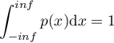
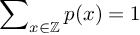
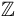
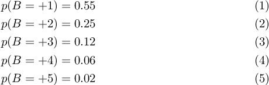
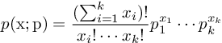
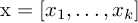
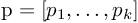
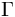
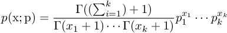
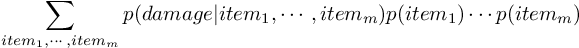

# 一个决策采样器

## 作者：Jessica B. Hamrick
*Jess是一个加州大学伯克利分校的博士生。她通过把机器学习的概率模型和认知科学中的行为实验结合在一块来研究人类的认知行为。她在闲暇时间还是IPython和Jupyter的核心贡献者。她之前在麻省理工获得了计算机科学的本科和硕士学位。*

----
## 简介

在计算机科学与工程科学中，我们常常会遇到不能简单的用一个方程就能解决的问题。这些问题常常涉及到复杂系统，充满噪声的输入，或者两者并存。以下是几个真实世界中的问题，他们都没有一个精确的解析解：

1. 你在计算机中建立了一架飞机的模型，然后你想知道这个飞机在不同天气状况下的表现；
2. 基于一个地面水扩散的模型，你想评估由一个拟建的化工厂的化学排放会怎样影响周边居民的淡水供应；
3. 你有一个机器人通过他的摄像头捕捉充满噪声的图片，然后你想恢复出这些图片中物体的三维结构；
4. 你想计算你走了某一步棋之后你赢棋的概率。

虽然这些类型的问题不能被精确的求解，但我们通常能够用*蒙特卡洛采样*的办法得到一个大概的解。在蒙特卡洛方法中，核心思想就是使用大量的样本来预估最概然的解<sup>1</sup>。

## 什么是采样？

采样是指基于某个概率分布随机的产生数值。举个例子，扔骰子所得到的数值就是采样的行为。从被洗过的牌堆顶摸的牌也是采样。飞镖射中靶上的某一个位置也是采样。这些采样中的唯一区别在于他们基于不同的概率分布。在骰子这个例子中，概率分布在六个可能的值等权重分布。在牌的例子中，概率分布在52个可能的值中等权重分布。在飞镖的例子中，概率分布分布于一个环形/圆形区域内（虽然这个分布可能不是均匀的，取决于你玩飞镖的水平）。

通常有两种我们希望使用采样的方式。第一种是随机采样的数值被存储起来以便之后使用：在一个计算机扑克游戏里边随机摸到的牌就属于这种情况。第二种情况中，采样被用于估算。举个例子，假设你怀疑你的朋友用的骰子有问题，你就会多掷几次骰子来看是不是有的数出现的频率远远高于你的预期。在飞机的例子中，也许你仅仅想在一系列的可能性中对飞机进行特性描述。天气是一个特别混乱的系统，永远都不可能精确的计算出飞机在某种特定天气情况下是否能够幸存。然而你可以多次的模拟飞机在不同天气状况下的行为，从而能够得出飞机在某些特定条件下最容易失事。

## 编程实现采样和概率

如同大多数计算机科学中的应用，你在编程实现采样和概率的时候可以做设计决定，这些决定会对代码整体的整洁性，相关性和正确性产生影响。在此小节中，我们会展示一个电脑游戏中如何随机采样的小例子。我们尤其会专注于设计决定，这些决定具体关于如何设计采样和估算概率的函数，与对数打交道，建立可重复性，以及把特定应用和产生采样过程分别开来的步骤。

### 关于记号

我们使用*p(x)*来表示*p*是*x*这个随机数的概率密度函数（PDF）或者概率质量函数。PDF是是一个连续函数，满足；然而PMF是一个离散函数,满足,其中表示整域。

在飞镖的情况里，概率分布是连续的PDF，然而骰子的概率分布是离散的PMF。两者共同的一点是无论*x*值如何，*p(x)>=0*，也就是说概率必须是非负值。

我们通常用概率分布来做两件事情。对给定的一个随机值*x*,我们希望能计算这个值在某一PDF/PMF中所对应的概率密度 （或质量）。我们用*p(x)*这样的数学符号来表示*x*的概率密度。

对于给定的PDF或PMF，我们会希望生成符合该分布函数的随机值*x*(这样我们在概率较高的*x*值处更有机会得到一个采样)。我们用*x~p*来表示*x*是根据*p*分布采样的随机值。

# 随机生成魔法装备

为了展示运用采样中的一些设计决定，我们用一个角色扮演游戏来作为例子。我们需要一个生成怪物随机掉落的魔法装备附加属性值的方法。我们可以人为的决定一个装备可以获得的总共最大附加值是＋5，而且高附加属性值出现的概率会小于低附加属性值的概率。如果*B*是一个位于0和最大附加值之间的随机数值，那么它的分布可以写作



我们还可以声明共有6种属性（敏捷，体质，力量，智力，智慧，魅力），随机得到的总附加值将在这六项里分配。所以一个＋5的装备可以将分配在不同属性里（比如＋2智慧和＋3智力）或者集中在某一项属性里（比如＋5魅力）。

如何能随机地从这个概率分布里采样？最简单的方法是先随机产生总属性值，然后再随机将总附加值分配在六项属性里。巧合的是，总附加值和属性分配这两者所对应的概率质量函数正好都是多项分布。

# 多项分布

多项分布用于描述有多种可能的结果时，你想要描述各种可能结果发生的概率。最经典用于解释多项分布的例子是瓮中取球的问题。问题的描述是：有一个瓮，瓮里有不同颜色的球（例如，30%红球，20%蓝色和50%绿色）。每次取出一个球，记录它的颜色，把这个球放回瓮中，再多次重复上述过程。在这种情况下，问题可能的结果即是取出的球的颜色（例如，取出的球是蓝色的概率是*p*(blue)=20)。多项分布被用于描述取出多个球时可能结果的组合（比如，两绿一蓝）。

以下部分的代码在`multinomial.py`文件中。

## MultinomialDistribution类

一般来讲，有两种使用一个分布的情况：第一种，我们希望根据这个分布进行采样；第二种，我们希望评估某一个样本在这个分布的PMF／PDF下可能出现的概率。虽然实现这两个目标的函数其实很不一样，但他们都依赖于一点共同的信息：这个分布的参数。在多项分布的情况里，它的参数时各种可能事件的概率，*p*(在瓮中取球的例子中，这个参数对应在文中在瓮中不同颜色的球数目的比例)。

最简单的解法是建两个函数，这两个函数相互独立，但都将该多项分布的参数作为函数的输入。但是我通常选择使用一个类来代表一个分布，这么做有几个好处：
1. 只需要将分布参数传入一次（在创建这个类时）；
2. 我们或许会对一些与这个分布相关的属性感兴趣：平均值，方差，倒数，等等。如果我们有一系列函数以分布对象为参数，用同一个分布的类来封装这些函数比每次调用一个函数都需要穿入分布参数方便得多
3. 检查参数是否有效通常是个好主意（例如在多项分布的例子里，事件概率的矢量*p*求和应当归一）。在构造函数里检查一次比起每次调用一个函数都要检查会有效率的多。
4. 有时候计算PMF和PDF需要根据给定参数计算常量。我们可以在构造函数里提前计算这些常量，从而避免重复计算。

这也是实际情况中很多统计包设计的方式，包含SciPy自己的分布（他们位于`scipy.stats`模块中）。出于教学展示的目的，虽然我们使用很多SciPy的函数，但我们没有使用他们自带的概率分布（目前Scipy包中没有多项分布）。

以下是这个类的构造函数的代码：
```python
import numpy as np

class MultinomialDistribution(object):

    def __init__(self, p, rso=np.random):
        """Initialize the multinomial random variable.

        Parameters
        ----------
        p: numpy array of length `k`
            The event probabilities
        rso: numpy RandomState object (default: None)
            The random number generator

        """

        # Check that the probabilities sum to 1. If they don't, then
        # something is wrong! We use `np.isclose` rather than checking
        # for exact equality because in many cases, we won't have
        # exact equality due to floating-point error.
        if not np.isclose(np.sum(p), 1.0):
            raise ValueError("event probabilities do not sum to 1")

        # Store the parameters that were passed in
        self.p = p
        self.rso = rso

        # Precompute log probabilities, for use by the log-PMF, for
        # each element of `self.p` (the function `np.log` operates
        # elementwise over NumPy arrays, as well as on scalars.)
        self.logp = np.log(self.p)
```

这个类需要两个参数，一个是事件概率*p*,另一个是叫做`rso`的变量。第一步，构造函数检查分布的参数是否有效，也就是说，`p`的和是否归一。然后它将传入的参数存储在对象内，再用事件概率来计算对数事件概率（我们会解释为什么需要用对数）。`rso`对象是我们用来产生随机数的引擎（我们之后也会更深入谈论这个对象）。

在介绍这个类的别的部分之前，让我们先看看关于构造函数的两点。

### 描述性变量名对数学变量名

程序员们一般倾向于使用描述性的变量名字：比如，用`independent_variable`和`dependent variable`作为变量名通常比用`x`和`y`要好。根据经验来看，一般不推荐使用仅有一个或两个字符的名字来命名变量。但是，在我们的`MultinomialDistribution`里，我们用到了变量命名为`p`,这直接违反了这一传统命名法则。

虽然我同意在大部分情况中应当执行上述的命名法则，但是有一种例外情况：数学。在程序中实现数学方程时，方程里通畅充满了单个字符的变量，*x*, *y*, *alpha*, 等等。在程序中直接用这些名字命名相应变量是最便捷的方式。当然，这些名字并没有包涵很多的信息，但是使用描述性的变量反而会破坏代码与公式之间的联系，使得理解代码更加困难。

我认为在写一个直接实现某公式的程序的时候，变量名应该与公式里的变量保持一致。这样使得代码和公式能够一一对应起来。然而这么做的副作用是单独看某一部分代码的时候理解更困难了，所以在代码中插入丰富的评论来解释当前部分代码实现的功能非常重要。如果被实现的公式出现在了学术文章里，评论就应当引用该公式在学术文章里的编号，以便查找。

### 载入NumPy包

你可能注意到我们在程序开头载入了`numpy`包，并用`np`代指它。这是数值运算中的标准做法，因为NumPy提供了海量有用的程序。有的文件里边常常会使用多个NumPy包里的函数。在此章节这个简单的例子中，我们仅仅使用了11个NumPy包里的函数。在一个项目中，通常这个数目会轻松达到40个左右！

载入Numpy有几种不同的办法。我们可以用`from numpy import *`，但是通常不鼓励这么做，因为没有了命名空间，我们很难区别每一个函数的来源。我们也可以单独地载入每一个函数，如`from numpy import array, log, ...`，但是这个方法很快就变得很笨重。我们还可以直接用`import numpy`,但这样导致的结果是代码过长，阅读起来不方便。下边两个例子都不是很方便阅读，但是用`np`作为命名空间明显比用`numpy`清楚的多。
```python
>>> numpy.sqrt(numpy.sum(numpy.dot(numpy.array(a), numpy.array(b))))
>>> np.sqrt(np.sum(np.dot(np.array(a), np.array(b))))
```

## 从一个多项分布里采样

从一个多项分布里采样实际上特别的直接，因为NumPy提供了一个函数实现这样的功能：`np.random.multinomail`<sup>2</sup>

尽管这个函数已经存在，为了设计多项分布的类还有几个决定需要我们来做。

### 给随机数产生器提供种子

虽然我们希望得到*随机*的采样，但有时候我们希望最后的结果是可重复的。尽管产生的数值看上去是随机的，如果我们重新运行一遍程序，我们希望程序能够使用完全相同的一个“随机”数值的序列。

为了能够生成这种“可重复随机”数，我们需要能控制采样函数生成随机的方式。这样的功能可以通过使用一个NumPy里的`RandomState`对象来实现。这个对象可以作为参数进行传递。它拥有与`np.random`大部分相同的函数；唯一的区别是通过这个对象我们可以控制随机数是从哪儿来的。创建该对象的方法如下：
```python
>>> import numpy as np
>>> rso = np.random.RandomState(230489)
```
在上述代码中传递给`RandomsState`构造函数的整数就是这个随机数产生器的种子。只要我们用同一个种子来实例化对象，`RandomState`对象就会输出一模一样的“随机数”序列，从而保证了可重复性：
```python
>>> rso.rand()
0.5356709186237074
>>> rso.rand()
0.6190581888276206
>>> rso.rand()
0.23143573416770336
>>> rso.seed(230489)
>>> rso.rand()
0.5356709186237074
>>> rso.rand()
0.6190581888276206
```
之前在多项分布类的构造函数中有一个参数为`rso`. 这个`rso`变量就是一个已经初始化了的`RandomState`对象。在这`RandomState`对象是一个可选的参数：有时候避免强制使用它比较方便，但是我们希望保留使用该对象的可能（如果只用`np.random`模块的话，“可重复”是做不到的）。

所以，如果在调用函数时`rso`是空缺的，那么构造函数默认的参数是`np.random.multinomial`。反之，构造函数会使用`RandomState`里的多项分布采样函数。<sup>3</sup>

### 用什么作为参数？

一旦我们决定了使用`np.random.multinomial`或者`rso.multinomial`，采样就仅仅是调用相对的函数而已。但是还有另一个需要我们考虑的决定：用什么作为参数？

之前我说到事件的可能性，*p*，是多项分布的参数。但是有的人认为需要采样的事件数，*n*，也可以作为多项分布的一个参数。所以为什么在这没有将*n*也作为构造函数的参数？

虽然这个问题仅仅局限于多项分布，但其实在处理其它概率分布的时候也会遇到。这个问题的答案很多时候取决于具体案例。对于一个多项分布，每次采样的事件数目总是一样的么？如果这个问题答案是肯定的，那么构造函数最好还是把*n*作为一个参数。如果答案是否定的，那么把限定对象一个具体的*n*会导致每次需要采样的时候，都需要构建一个新的分布对象！

通常代码不应该被严格限制到这个程度，因此我们选择把`n`作为采样函数`sample`的参数，而不把它传给分布的构造函数。另一个替代办法是把`n`作为构造函数的参数，但是建立一个方法来改变对象中`n`的值，从而避免重新建立一个新对象。在我们的情况里，这种方案过于复杂了，因此我们采用前一种方法：
```python
def sample(self, n):
    """Samples draws of `n` events from a multinomial distribution with
    outcome probabilities `self.p`.

    Parameters
    ----------
    n: integer
        The number of total events

    Returns
    -------
    numpy array of length `k`
        The sampled number of occurrences for each outcome

    """
    x = self.rso.multinomial(n, self.p)
    return x
```
## 计算多项分布的PMF

虽然我们并不需要显式的计算随机生成的魔法物品的概率，但是实现一个能够计算该分布的PMF/PDF的函数往往是一个好主意。为什么？

一个原因是我们可以把该函数用于测试：假设我们用采样函数生成了很多样本，他们的分布应该大致与初始的PMF／PDF一致。假如众多样本的统计分布与初始PMF／PDF不一致，那么我们的程序里多半有bug。

另一个需要实现这么一个函数的原因是之后你多半需要这么一个函数。举个例子，我们可能需要将生成的魔法物品归类为普通，罕见和稀有。划分等级的标准来自于产生样本的概率。为了得到这个概率，就需要计算样本对应的PMF。

最后，在很多情况里，你自己的使用需求就决定了从一开头就需要实现计算PMF／PDF的功能。

### 多项分布PMF公式

多项分布的严格定义如下：



其中是一个长度为*k*的向量，表示每一件事件发生的次数；而是一个表示每件事件发生一次的概率的向量。正如上文提到，时间概率*p*是这个分布的参数。

上边公式里的阶乘可以用一个特殊函数来表示，称作gamma函数。在代码中，写gamma函数比写阶乘有效率得多。因此方程被改写成以下的形式：



### 概率使用对数值

在介绍实现这一公式的程序之前，我想要强调在写关于概率的代码中最为重要的一个设计决定：使用对数数值。这意味着程序中与其使用实际的概率*p(x)*,我们应该用概率的对数,log(*p(x)*)。这么做的原因是概率很容易会变得很小，进入浮点数误差范围造成数据下溢。

为了展示这一点，假设概率必须在0到1之间（包涵1）。NumPy有一个有用的函数，`finfo`，能够告诉我们当前系统的浮点数的极限。比如，在一台64位饿机器上，可以看见最小可用的正数（对应`tiny`变量）是：
```python
>>> import numpy as np
>>> np.finfo(float).tiny
2.2250738585072014e-308
```
虽然这个值看上去非常小，但是我们经常碰到这个数量级上的概率，甚至更小。而且几个概率相乘是非常常见的操作。假如我们将两个这个量级的概率相乘，结果将会是下溢：
```python
>>> tiny = np.finfo(float).tiny
>>> # if we multiply numbers that are too small, we lose all precision
>>> tiny * tiny
0.0
```
但是，对概率取对数会缓和这个问题，因为我们在相同的存储空间内能表达的数字范围相比不取对数大了很多。对数在概率里的取值范围是从负无穷到0。在实际情况中，对数取值范围从系统最小的负数（对应`finfo`返回`min`值）到0。这个`min`值比`tiny`的对数小得多（假如我们在对数空间进行操作的话，`tiny`就是下限）。
```python
>>> # this is our lower bound normally
>>> np.log(tiny)
-708.39641853226408
>>> # this is our lower bound when using logs
>>> np.finfo(float).min
-1.7976931348623157e+308
```
因此，通过在对数空间工作，我们极大的扩大了可表示的数值范围。而且在对数空间里，正常空间的乘法变成了加法，比如log(x.y) = log(x) + log(y)。所以之前因为概率相乘损失精度的问题也不会像以前一样困扰我们：
```python
>>> # the result of multiplying small probabilities
>>> np.log(tiny * tiny)
-inf
>>> # the result of adding small log probabilities
>>> np.log(tiny) + np.log(tiny)
-1416.7928370645282
```
但这并不是一个一劳永逸的办法。假如我们需要将对数的概率变换回正常的概率，还是会有数据下溢的问题：
```python
>>> tiny*tiny
0.0
>>> np.exp(np.log(tiny) + np.log(tiny))
0.0
```
尽管如此，在对数空间进行计算省了很多麻烦。虽然转换回正常的概率还是会损失精度，但起码关于概率的一些额外信息得到了保存（比如两个小概率比较大小的问题）。

### 实现PMF的代码

既然我们已经看到了在对数空间工作的重要性，我们首先实现计算log-PMF的程序：
```
def log_pmf(self, x):
    """Evaluates the log-probability mass function (log-PMF) of a
    multinomial with outcome probabilities `self.p` for a draw `x`.

    Parameters
    ----------
    x: numpy array of length `k`
        The number of occurrences of each outcome

    Returns
    -------
    The evaluated log-PMF for draw `x`

    """
    # Get the total number of events
    n = np.sum(x)

    # equivalent to log(n!)
    log_n_factorial = gammaln(n + 1)
    # equivalent to log(x1! * ... * xk!)
    sum_log_xi_factorial = np.sum(gammaln(x + 1))

    # If one of the values of self.p is 0, then the corresponding
    # value of self.logp will be -inf. If the corresponding value
    # of x is 0, then multiplying them together will give nan, but
    # we want it to just be 0.
    log_pi_xi = self.logp * x
    log_pi_xi[x == 0] = 0
    # equivalent to log(p1^x1 * ... * pk^xk)
    sum_log_pi_xi = np.sum(log_pi_xi)

    # Put it all together
    log_pmf = log_n_factorial - sum_log_xi_factorial + sum_log_pi_xi
    return log_pmf
```
这个函数是上述计算多项分布PMF的一个直接实现。其中`gammaln`函数来自于`scipy.special`，它计算log-gamma的值。正如上文提到，因为SciPy提供了这么一个log-gamma函数，所以计算阶乘的对数比计算它本身要便捷和高效很多。我们也可以自己计算一个log阶乘的值，类似：
```python
log_n_factorial = np.sum(np.log(np.arange(1, n + 1)))
sum_log_xi_factorial = np.sum([np.sum(np.log(np.arange(1, i + 1))) for i in x])
```
但是使用SciPy提供的`gammaln`函数方便也便于理解。

其中有一个corner case需要我们解决：当某一事件概率为0时，log(pi)=-inf。这本身对程序没有很大的影响，但是假如这个值乘以0之后就会成为一个问题：
```python
>>> # it's fine to multiply infinity by integers...
>>> -np.inf * 2.0
-inf
>>> # ...but things break when we try to multiply by zero
>>> -np.inf * 0.0
nan
```
`nan`代表“not a number”，它一般会带来很多头痛的问题，因为大多数对`nan`的运算结果是另一个`nan`。假如我们不处理*p_i*=0和*x_i*=0的情况，他们的乘积是一个`nan`。这个结果与其他的数值相加求和，得到另一个`nan`，对我们一点用也没有。所以在程序中，我们检查是否有*x_i*=0的情况，如果是认为的把*x_i.log(p_i)*设为0。

让我们回到使用对数空间的讨论上来。即使我们需要一个正常空间的PMF，通常的做法是先计算log－PMF，再对该数取指数，得到PMF：
```python
def pmf(self, x):
    """Evaluates the probability mass function (PMF) of a multinomial
    with outcome probabilities `self.p` for a draw `x`.

    Parameters
    ----------
    x: numpy array of length `k`
        The number of occurrences of each outcome

    Returns
    -------
    The evaluated PMF for draw `x`

    """
    pmf = np.exp(self.log_pmf(x))
    return pmf
```
为了强调使用对数的重要性，这里有一个多项分布的例子：
```python
>>> dist = MultinomialDistribution(np.array([0.25, 0.25, 0.25, 0.25]))
>>> dist.log_pmf(np.array([1000, 0, 0, 0])
-1386.2943611198905
>>> dist.log_pmf(np.array([999, 0, 0, 0])
-1384.9080667587707
```
在这个情况下，我们得到一个极小的概率（比`tiny`值还小）。这是因为PMF中的分母巨大（1000的阶乘因为数据上溢而没法计算。但是这个阶乘的log却是可以计算的：
```python
>>> from scipy.special import gamma, gammaln
>>> gamma(1000 + 1)
inf
>>> gammaln(1000 + 1)
5912.1281784881639
```
如果我们是用`gamma`来计算PMF，就会出现`gamma(1000+1)/gamma(1000+1)`的情况。而这个表达式的结果会是`nan`（而不是1）。但是因为计算在对数空间进行，这对我们来说就不是一个问题！

# 回到采样魔法装备

现在多项分布的函数已经写好了，我们现在使用它们来随机生成魔法装备。为了这个目标，我们建立了一个叫做`MagicItemDistribution`的类，位于`rpg.py`文件里。
```
class MagicItemDistribution(object):

    # these are the names (and order) of the stats that all magical
    # items will have
    stats_names = ("dexterity", "constitution", "strength",
                   "intelligence", "wisdom", "charisma")

    def __init__(self, bonus_probs, stats_probs, rso=np.random):
        """Initialize a magic item distribution parameterized by `bonus_probs`
        and `stats_probs`.

        Parameters
        ----------
        bonus_probs: numpy array of length m
            The probabilities of the overall bonuses. Each index in
            the array corresponds to the bonus of that amount (e.g.,
            index 0 is +0, index 1 is +1, etc.)

        stats_probs: numpy array of length 6
            The probabilities of how the overall bonus is distributed
            among the different stats. `stats_probs[i]` corresponds to
            the probability of giving a bonus point to the ith stat;
            i.e., the value at `MagicItemDistribution.stats_names[i]`.

        rso: numpy RandomState object (default: np.random)
            The random number generator

        """
        # Create the multinomial distributions we'll be using
        self.bonus_dist = MultinomialDistribution(bonus_probs, rso=rso)
        self.stats_dist = MultinomialDistribution(stats_probs, rso=rso)
```

`MagicItemDistribution`的构造函数里需要的参数有：总附加属性值分布概率（`bonus_probs`），各项属性的分布概率(`stats_probs`)，和随机数生成器。虽然之前我们确定了所需的总附加属性值分布，把这个分布作为一个传入参数是一个好主意。这样添加了用该函数对其它分布进行采样的可能（例如总附加属性值会根据玩家的级别变化）。我们把属性名字作为属性（`stats_names`）添加在了类中，其实这个变量也可以作为构造函数的一个参数。

如上文提到，随机采样一个魔法装备需要两步：第一步先采样总附加属性值，第二步再随机分配数值到各项属性中。我们将这两步分别用不同的函数实现`_sample_bonus`和`_sample_stats`：
```python
def _sample_bonus(self):
    """Sample a value of the overall bonus.

    Returns
    -------
    integer
        The overall bonus

    """
    # The bonus is essentially just a sample from a multinomial
    # distribution with n=1; i.e., only one event occurs.
    sample = self.bonus_dist.sample(1)

    # `sample` is an array of zeros and a single one at the
    # location corresponding to the bonus. We want to convert this
    # one into the actual value of the bonus.
    bonus = np.argmax(sample)
    return bonus

def _sample_stats(self):
    """Sample the overall bonus and how it is distributed across the
    different stats.

    Returns
    -------
    numpy array of length 6
        The number of bonus points for each stat

    """
    # First we need to sample the overall bonus
    bonus = self._sample_bonus()

    # Then, we use a different multinomial distribution to sample
    # how that bonus is distributed. The bonus corresponds to the
    # number of events.
    stats = self.stats_dist.sample(bonus)
    return stats
```
我们可以把这两个函数合成一步--尤其因为`_sample_stats`是唯一使用到`_sample_bonus`的函数。这里把它们分开来是为了便于理解和便于测试。

你会注意到这些函数以下划线开头，说明它们并不是类的外部接口。我们提供的采样接口为`sample`:
```python
def sample(self):
    """Sample a random magical item.

    Returns
    -------
    dictionary
        The keys are the names of the stats, and the values are
        the bonus conferred to the corresponding stat.

    """
    stats = self._sample_stats()
    item_stats = dict(zip(self.stats_names, stats))
    return item_stats
```
`sample`函数实际上只是调用`_sample_stats`，另外把随机采样的数值和对应属性名字组成字典输出。这样采样的装备能有一个清楚易懂的界面（哪项属性有几点附加值），但是也保留了多次调用`_sample_stats`的可能性（如果需要一次得到多个样本或者追求效率）。

我们使用同样的设计来计算得到某一件装备的概率。同样，高层的接口方法`pmf`和`log_pmf`将接受`sample`输出的字典为参数：
```python
def log_pmf(self, item):
    """Compute the log probability of the given magical item.

    Parameters
    ----------
    item: dictionary
        The keys are the names of the stats, and the values are
        the bonuses conferred to the corresponding stat.

    Returns
    -------
    float
        The value corresponding to log(p(item))

    """
    # First pull out the bonus points for each stat, in the
    # correct order, then pass that to _stats_log_pmf.
    stats = np.array([item[stat] for stat in self.stats_names])
    log_pmf = self._stats_log_pmf(stats)
    return log_pmf

def pmf(self, item):
    """Compute the probability the given magical item.

    Parameters
    ----------
    item: dictionary
        The keys are the names of the stats, and the values are
        the bonus conferred to the corresponding stat.

    Returns
    -------
    float
        The value corresponding to p(item)

    """
    return np.exp(self.log_pmf(item))
```
这些方法调用了一个`_stats_log_pmf`函数，它计算得到某属性分布的概率（接受的参数类型是一个数组）：
```python
def _stats_log_pmf(self, stats):
    """Evaluate the log-PMF for the given distribution of bonus points
    across the different stats.

    Parameters
    ----------
    stats: numpy array of length 6
        The distribution of bonus points across the stats

    Returns
    -------
    float
        The value corresponding to log(p(stats))

    """
    # There are never any leftover bonus points, so the sum of the
    # stats gives us the total bonus.
    total_bonus = np.sum(stats)

    # First calculate the probability of the total bonus
    logp_bonus = self._bonus_log_pmf(total_bonus)

    # Then calculate the probability of the stats
    logp_stats = self.stats_dist.log_pmf(stats)

    # Then multiply them together (using addition, because we are
    # working with logs)
    log_pmf = logp_bonus + logp_stats
    return log_pmf
```
该方法`_stats_log_pmf`调用`_bonus_log_pmf`函数,后者计算得到某个总附加属性值的概率：
```python
def _bonus_log_pmf(self, bonus):
    """Evaluate the log-PMF for the given bonus.

    Parameters
    ----------
    bonus: integer
        The total bonus.

    Returns
    -------
    float
        The value corresponding to log(p(bonus))

    """
    # Make sure the value that is passed in is within the
    # appropriate bounds
    if bonus < 0 or bonus >= len(self.bonus_dist.p):
        return -np.inf

    # Convert the scalar bonus value into a vector of event
    # occurrences
    x = np.zeros(len(self.bonus_dist.p))
    x[bonus] = 1

    return self.bonus_dist.log_pmf(x)
```
我们可以这样创建自己的分布：
```python
>>> import numpy as np
>>> from rpg import MagicItemDistribution
>>> bonus_probs = np.array([0.0, 0.55, 0.25, 0.12, 0.06, 0.02])
>>> stats_probs = np.ones(6) / 6.0
>>> rso = np.random.RandomState(234892)
>>> item_dist = MagicItemDistribution(bonus_probs, stats_probs, rso=rso)
```
分布一旦建立，我们就可以随机的产生一些装备：
```python
>>> item_dist.sample()
{'dexterity': 0, 'strength': 0, 'constitution': 0, 
 'intelligence': 0, 'wisdom': 0, 'charisma': 1}
>>> item_dist.sample()
{'dexterity': 0, 'strength': 0, 'constitution': 1, 
 'intelligence': 0, 'wisdom': 2, 'charisma': 0}
>>> item_dist.sample()
{'dexterity': 1, 'strength': 0, 'constitution': 1, 
 'intelligence': 0, 'wisdom': 0, 'charisma': 0}
```
我们可以计算得到某一件装备的概率：
```python
>>> item = item_dist.sample()
>>> item
{'dexterity': 0, 'strength': 0, 'constitution': 0, 
 'intelligence': 0, 'wisdom': 2, 'charisma': 0}
>>> item_dist.log_pmf(item)
-4.9698132995760007
>>> item_dist.pmf(item)
0.0069444444444444441
```
# 估算攻击伤害

以上已经展示了一个采样的例子：产生怪物随机掉落的装备。之前提到还可以利用采样计算跟一个分布整体相关的一些属性。我们可以用`MagicItemDistribution`做这件事。例如，我们的RPG游戏里攻击伤害是通过掷一些数目的骰子（D12，12面骰子）来决定的。玩家默认一次掷一个骰子，假如力量属性加成＋1，就多扔一个骰子。也就是说假如有力量＋2属性，他们一次可以掷三个骰子。造成的伤害是三个骰子的值之和。

我们可能会想知道一个玩家在找到某些武器之后能够造成多少伤害；这能指导我们调整怪物的难度。假设拿到两件装备之后，我们希望玩家能在50%的战斗中用不多于3次打击战胜怪物。那么怪物的血量应该被设定为多少？

解答这个问题的一种方式是通过采样，流程如下：

1. 随机生成一个魔法装备；
2. 基于装备的属性，计算攻击时需要掷几个骰子；
3. 基于骰子的数目，随机生成3次打击数造成的伤害总量；
4. 重复上述过程。最后得到伤害分布的近似数值解。

## 实现伤害分布

`DamageDistribution`类（也在`rpg.py`中）展示了该流程的实现：

```python
class DamageDistribution(object):

    def __init__(self, num_items, item_dist,
                 num_dice_sides=12, num_hits=1, rso=np.random):
        """Initialize a distribution over attack damage. This object can
        sample possible values for the attack damage dealt over
        `num_hits` hits when the player has `num_items` items, and
        where attack damage is computed by rolling dice with
        `num_dice_sides` sides.

        Parameters
        ----------
        num_items: int
            The number of items the player has.
        item_dist: MagicItemDistribution object
            The distribution over magic items.
        num_dice_sides: int (default: 12)
            The number of sides on each die.
        num_hits: int (default: 1)
            The number of hits across which we want to calculate damage.
        rso: numpy RandomState object (default: np.random)
            The random number generator

        """

        # This is an array of integers corresponding to the sides of a
        # single die.
        self.dice_sides = np.arange(1, num_dice_sides + 1)

        # Create a multinomial distribution corresponding to one of
        # these dice.  Each side has equal probabilities.
        self.dice_dist = MultinomialDistribution(
            np.ones(num_dice_sides) / float(num_dice_sides), rso=rso)

        self.num_hits = num_hits
        self.num_items = num_items
        self.item_dist = item_dist

    def sample(self):
        """Sample the attack damage.

        Returns
        -------
        int
            The sampled damage

        """
        # First, we need to randomly generate items (the number of
        # which was passed into the constructor).
        items = [self.item_dist.sample() for i in xrange(self.num_items)]

        # Based on the item stats (in particular, strength), compute
        # the number of dice we get to roll.
        num_dice = 1 + np.sum([item['strength'] for item in items])

        # Roll the dice and compute the resulting damage.
        dice_rolls = self.dice_dist.sample(self.num_hits * num_dice)
        damage = np.sum(self.dice_sides * dice_rolls)
        return damage
```
构造函数接收的参数有：骰子的面数，需要计算的打击次数，玩家拥有的魔法装备数目，魔法装备的分布（`MagicItemDistribution`类），一个随机数产生器。默认的骰子面数`num_dice_sides`是12。虽然这个量是一个参数，但是它改变的可能较小。类似的，打击次数的默认数值被设置为1，因为大多数时候我们希望看到打击一次的伤害分布。

接下来实际的采样逻辑在`sample`中实现（请注意结构上与`MagicItemDistribution`类似的地方）。首先，我们生成玩家拥有的一系列魔法装备。然后我们从装备上力量属性的加成计算出需要掷的骰子的个数。最后我们掷骰子（再一次使用我们的多项分布函数）来计算造成的总伤害。

### 计算概率的方法到哪儿去了？

你也许注意到在`DamageDistribution`里我们并没有实现类似`log_pmf`和`pmf`的方法。这是因为我们不知道实际上的PMF的解析形式！该概率分布可以用以下的公式表达：



这个公式给出的解是对于所有可能的m个武器组合，计算出所有可能的伤害概率分布。用暴力解法是可以照着这个公式求解，但并不漂亮。这是一个完美的案例解释为什么我们会用采样来求出问题的近似解（当得到问题的精确解是不可能的或者很困难的时候）。因此，下一部份我们会介绍如何用采样来取得一个近似分布。

## 得到近似分布

现在我们有了回答之前问题的工具：假如一个玩家有两个装备，我们想让玩家在50%的战斗中能够用不多于3次的打击击败怪物，那么怪物的血量应该设置为多少？

首先，我们创建一个伤害分布的对象（使用之前创建的`item_dist`和`rso`):
```python
>>> from rpg import DamageDistribution
>>> damage_dist = DamageDistribution(2, item_dist, num_hits=3, rso=rso)
```
现在进行大量采样，计算伤害值大于%50的样本阈值：
```python
>>> samples = np.array([damage_dist.sample() for i in xrange(100000)])
>>> samples.min()
3
>>> samples.max()
154
>>> np.percentile(samples, 50)
27.0
```
如果我们将伤害样本作一个统计直方图，得到以下的结果:


可以看到玩家可能输出的伤害范围非常的大，而且该分布有一个长尾：50%样本里玩家们的伤害是低于27点的。因此如果我们要依据该标准设定怪物的难度，怪物的血量应被设为27点。

# 总结
在本章节里，我们看到了如何从非标准的概率分布里进行采样，也看到了如何计算样本在分布里对应概率。在这个过程中，我们也设计了一些一般情况下适用的设计决定：
1. 用一个类来代表一个概率分布，在里边包括从这个分布采样和计算PMF／PDF的函数；
2. 用对数计算PMF／PDF;
3. 从同一个随机数产生器对象生成样本以保证可重复性；
4. 实现的外部接口函数做到输入和输出清晰易懂（比如用字典作为`MagicItemDistribution.sample`的输出）。对于不那么清晰但更高效的函数（比如`MagicItemDistribution._sample_stats`），保留从外部访问这些函数的可能。

另外，我们看到了采样在生成单个随机数值（比如生成怪物随机掉落装备）和在计算与一个分布相关的某些信息（比如计算玩家拥有两样装备之后的伤害分布）是很有用的。几乎所有的采样都会落入这两种用法之中；唯一的区别在于具体的分布类型。整体的代码结构--独立于分布的部分--保持不变。


<sup>1</sup> 阅读这篇文章需要一些统计学和概率论的基础知识。

<sup>2</sup> NumPy包涵了多个从不同类型分布里采样函数。如果需要完整的列表，可以查询随机采样的模块`np.random`。

<sup>3</sup> `np.random`里这个函数其实依赖于一个我们可以控制的随机数生成器：NumPy的全局随机数生成器。全局的随机数种可以通过`np.seed`来改变。使用全局生成器和局部`RandomState`对象是有取舍的。如果使用全局生成器，那么就不需要传递`RandomState`对象。但是有可能有你不知道的第三方代码也在使用全局生成器。如果使用一个局部的对象，通常更容易发现结果的随机性是来自于自己的代码还是别处。
