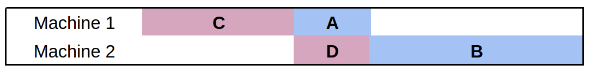

# 流水车间调度器

> 作者: Christian Muise博士
> [Christian Muise博士](http://haz.ca)是[基于模型的嵌入式和机器人系统 (MERS ) 研究组](http://groups.csail.mit.edu/mers/)的研究员, 隶属于[麻省理工计算机科学与人工智能实验室 (CSAIL ) ](http://www.csail.mit.edu/). 他的兴趣包括了人工智能、数据驱动项目、制图、图论和数据可视化, 以及凯尔特音乐、雕刻、足球和咖啡等等. 

[原文](./flow-shop.markdown)

## 流水车间调度器

流水车间调度是运筹学中最为重要、研究最充分的问题之一. 与许多具有挑战性的优化问题一样, 对于实际规模的应用, 为这类问题找到最佳解决方案往往是不可能的. 在本章中,我们考虑了使用一种称为**局部搜索 (local search ) **的技术来实现一个流水车间调度求解器. 局部搜索能够在无法找到最佳解决方案时找到次优的解决方案. 求解器将尝试在给定的时间内找到问题的新解决方案,并返回所找到的最佳解决方案. 

局部搜索背后的想法是通过考虑类似的 (也许更好的 ) 解决方案来启发式地改进现有的解决方案. 求解器使用了一系列的策略：
1. 尝试找到类似的解决方案,

2. 选择一个有希望下一步探索的解决方案. 

我们的实现是用 Python 编写的,没有依赖任何外部Package. 通过利用 Python 一些鲜为人知的功能,求解器在求解过程中可以根据哪些策略可以正常工作来动态地更改其搜索策略. 

本文首先提供一些关于流水车间调度问题和局部搜索技术的背景资料. 然后,我们详细介绍了一般求解器的代码以及所使用的各种启发式算法和邻域选择策略. 接下来,我们将实现一个动态策略选择方法, 这个方法可以将求解器的所有内容组合在一起. 最后,我们总结了在该项目实施过程中所学到的一些经验. 

## 背景知识

### 流水车间调度器

流水车间调度问题是一个优化问题, 在这个问题中,我们必须确定作业中各种任务的处理时间, 以便计划任务, 最大限度地减少完成作业所需的总时间. 以一家拥有装配线的汽车制造商为例,在该工厂中, 汽车的每个部分都需要按一定顺序在不同的机器上完成. 不同的订单可能有不同的要求,例如, 绘画车身的任务会因汽车而异. 在我们的例子中,每种车型的生产被称为一种新的*作业 (job ) * , 汽车每个零部件的生产都被称为一个*任务  (task ) * . 每个作业都将由相同的任务序列来完成. 

流水车间调度的目标是最大限度地减少在每个作业中完成所有任务所需的总时间.  (通常情况下,
总时间称为 *完工时间 (makespan )* ) . 此问题有许多应用, 但与优化生产设施最为相关. 

每个流水车间调度问题都由 $n$ 台机器和 $m$个作业组成. 在我们的汽车例子中, 总共会有 $n$ 个汽车生产车间,还有 $m$ 种汽车需要制造. 每个作业都恰好由 $n$个任务组成, 我们可以假设作业的第 $i$ 个任务必须使用机器 (车间 )  $i$, 并且需要已经提前确定的处理时间$p(j,i)$ , 即完成工作$j$中的任务$i$所需要的时间. 此外,任何给定作业的任务顺序应遵循可用机器的顺序; 对于给定的工作, 任务 $i$必须在任务 $i+1$ 开始之前完成. 如在我们的汽车例子中, 我们不会想在车架组装完成之前就给汽车上色. 最后的限制是不能同时在一台机器上处理两个任务. 

由于作业中任务的顺序是预先确定的, 因此可以将流水车间调度问题的解决方案重新呈现为作业的排列. 在每台机器上处理的作业顺序总是相同的,并且给定一个任务的排列方法, 对于作业 $j$ 和机器 $i$，任务一定是在以下两种可能情况下被调度的:

1. 作业$j - 1$在机器 $ i$上的任务 (即同一台机器上的最新任务)已完成, 或
2. 机器$i - 1$在 作业 $j$中的任务 (即同一作业上的最新任务)已完成.

选择这两个值的最大值会导致机器 $i$ 或作业$j$ 上产生等待时间. 我们希望最小化等待时间,因为它们会导致总的完成时间延长. 

由于这一问题的一般性, 作业的任何排列都是一个有效的解决方案, 而最优解将对应于*某些* 特定的排列方式. 我们通过改变作业的排列并测量相应的完工时间来寻找改进的解决方案. 在下面的内容中, 我们将作业的某种排列方式称为 *候选项* . 

让我们考虑一个简单的例子, 其中有两个作业和两个机器. 第一个作业具有任务**A**和**B**, 分别需要1分钟和2分钟才能完成. 第二个作业具有任务**C**和**D**, 分别需要2分钟和1分钟才能完成. 其中**A**必须在**B**之前完成, **C**必须在**D**之前完成. 
因为有两个工作, 我们只有两个排列需要考虑. 如果我们在作业1之前完成作业2, 则完工时间为5 (见图 1
) ; 而如果我们在作业2之前完成作业1, 完工时间只有4 (见图 2). 



图 1


图 2

在这个例子中, 没有其它方法可以使得总任务更早地完成. 排列任务时, 一个好指导原则是最大限度地减少所有机器没有处理任务的空闲时间. 

### 局部搜索

局部搜索是在最优解难以计算的情况下解决优化问题的策略. 直观上理解, 它从一个看起来相当好的解决方案转移到另一个似乎更好的解决方案. 我们没有考虑每一个可能的解决方案作为下一个重点关注的方案, 而是定义了所谓的*邻域 (neighbourhood)* :被认为与目前的解决方案相似的一套解决方案. 因为任何作业的排列都是一个有效的解决方案, 所以我们可以把任何将作业洗牌的机制作为局部搜索的过程 (实际上,这就是我们下面所做的). 

要正式使用局部搜索, 我们必须回答几个问题:
1. 我们应该从什么解决方案开始？
2. 给出一个解决方案, 我们应该考虑的邻域是什么？
3. 给定一个邻域候选方案的集合, 我们应该考虑调整到哪一个方案？

以下三个部分依次讨论这些问题. 

## 通用规划求解

在本节中, 我们提供了流水车间调度程序的一般框架. 首先, 我们进行必要的 Python导入和求解器的设置:

```python
import sys, os, time, random

from functools import partial
from collections import namedtuple
from itertools import product

import neighbourhood as neigh
import heuristics as heur

##############
# # 设置 #
##############
TIME_LIMIT = 300.0  # 运行求解器的时间 (以秒为单位)
TIME_INCREMENT = 13.0  # 在启发式测量之间的时间 (以秒为单位)
DEBUG_SWITCH = False  # 显示中间启发式信息时为 True
MAX_LNS_NEIGHBOURHOODS = 1000   # 要在LNS中探索的最大邻居数
```

这里有两个设置, 需要更详细的解释 . 
`TIME_INCREMENT`设置将用作动态策略选择的一部分, 而`MAX_LNS_NEIGHBOURHOODS`
设置将用作邻域选择策略的一部分. . 下面将更详细地介绍这两个问题. 

这些设置可以 作为命令行参数提供给用户, 但在此阶段,
我们将输入数据作为参数提供给程序. 输入问题 (来自Taillard基准数据集的问题)
被假定为流水车间调度的标准格式.  以下代码作为 求解器文件的 `  _ main _ ` 方法,
并根据程序输入参数的数量调用适当的函数:

```python
if __name__ == '__main__':

    if len(sys.argv) == 2:
        data = parse_problem(sys.argv[1], 0)
    elif len(sys.argv) == 3:
        data = parse_problem(sys.argv[1], int(sys.argv[2]))
    else:
        print "\nUsage: python flow.py <Taillard problem file> [<instance number>]\n"
        sys.exit(0)

    (perm, ms) = solve(data)
    print_solution(data, perm)
```

我们简要描述一下Taillard程序(这些文件可[在线获取](http://mistic.heig-vd.ch/taillard/problemes.dir/ordonnancement.dir/ordonnancement.html)). 

`solve`方法期望收到一个`data`变量,该变量是一个包含了每个作业活动持续时间的整数列表. `solve`方法从初始化一组全局策略开始(如下所述). 这一方法的关键是使用 `strat _*`变量来维护有关这些策略的统计数据. 这有助于在求解过程中动态地选择策略. 

```python
def solve(data):
    "" 解决流水车间调度问题的实例 "

    # 我们在这里初始化策略, 以避免循环导入问题
    initialize_strategies()
    global STRATEGIES

    # 为每个策略记录以下内容:
    # improvements: 此策略对解决方案改进的程度
    #  time_spent: 此策略花费的时间
    #  weights: 策略好坏程度的权重
    # usage: 我们使用一个策略的次数
    strat_improvements = {strategy: 0 for strategy in STRATEGIES}
    strat_time_spent = {strategy: 0 for strategy in STRATEGIES}
    strat_weights = {strategy: 1 for strategy in STRATEGIES}
    strat_usage = {strategy: 0 for strategy in STRATEGIES}
```

流水车间调度问题一个吸引人的特点是,  *每个*排列都是一个有效的解决方案,且至少有一个最佳的临时解决方案 (尽管许多情况下完工时间都非常长). 值得庆幸的是,这允许我们放弃检查我们是否停留在可行的解决方案空间内,当从一个排列到另一个——一切都是可行的!

然而, 要在排列空间中开始局部搜索, 我们 必须有一个初始排列. 为了简单起见,我们通过随机洗牌作业列表来确定局部搜索的种子:

```python
    # 从工作的随机排列开始
    perm = range(len(data))
    random.shuffle(perm)
```

接下来, 我们初始化变量 , 使我们能够跟踪到目前为止发现的最佳排列,以及提供输出的计时信息. 

```python
    # 跟踪最佳解决方案
    best_make = makespan(data, perm)
    best_perm = perm
    res = best_make

    # 维护迭代的统计信息和计时
    iteration = 0
    time_limit = time.time() + TIME_LIMIT
    time_last_switch = time.time()

    time_delta = TIME_LIMIT / 10
    checkpoint = time.time() + time_delta
    percent_complete = 10

    print "\nSolving..."
```

由于这是一个局部搜索求解器, 只要没有达到时限,我们就会继续尝试改进解决方案. 我们提供指示求解器进度的输出,并跟踪我们计算的迭代次数:

```python
    while time.time() < time_limit:

        if time.time() > checkpoint:
            print " %d %%" % percent_complete
            percent_complete += 10
            checkpoint += time_delta

        iteration += 1
```

下面我们将描述策略是如何选择的, 但目前只需知道该策略提供了一个 `neighbourhood`函数和一个 `heuristic` 函数就够了. 前者给了我们 *下一组候选策略*需要考虑的集合, 而后者则从集合中选出 *最佳的候选策略* . 从这些函数中, 我们有一个新的排列组合 ( ` perm ` ) 和一个新的完工时间结果 ( ` res ` ):

```python
        # 启发式选择最佳策略
        strategy = pick_strategy(STRATEGIES, strat_weights)

        old_val = res
        old_time = time.time()

        # 使用当前策略的启发, 以从该策略邻域的候选解集中选取下一个组合
        
        candidates = strategy.neighbourhood(data, perm)
        perm = strategy.heuristic(data, candidates)
        res = makespan(data, perm)
```

计算完工时间的代码非常简单:我们可以通过评估排列中最终作业何时完成来来计算它. 后面我们将看到 `compile_solution`函数是如何工作的, 现在只需知道该函数返回了一个2D数组, 并且该数组的 `[-1] [-1]` 对应于计划中最后作业的开始时间就够了:

```python
def makespan(data, perm):
    "" 计算所提供解决方案的完工时间 "
    return compile_solution(data, perm)[-1][-1] + data[perm[-1]][-1]
```

为了选择 策略, 我们将统计：
1. 策略改进了解决方案的程度, 
2. 策略花费了多少时间来计算信息, 以及
3. 策略使用了多少次. 

如果我们发现了一个更好的解决方案, 我们还会更新最佳排列的变量:

```python
        # 记录有关该策略的统计数据
        strat_improvements[strategy] += res - old_val
        strat_time_spent[strategy] += time.time() - old_time
        strat_usage[strategy] += 1

        if res < best_make:
            best_make = res
            best_perm = perm[:]
```

策略使用的统计信息将会以固定的频率被更新. 为了便于阅读, 我们删除了相关的代码段,并详细介绍了下面的代码. 作为最后一步, 一旦 while 循环结束 (即达到了时间限制),我们将输出一些有关求解过程的统计信息, 并返回最佳排列及其完工时间:

```python
    print " %d %%\n" % percent_complete
    print "\nWent through %d iterations." % iteration

    print "\n(usage) Strategy:"
    results = sorted([(strat_weights[STRATEGIES[i]], i)
                      for i in range(len(STRATEGIES))], reverse=True)
    for (w, i) in results:
        print "(%d) \t%s" % (strat_usage[STRATEGIES[i]], STRATEGIES[i].name)

    return (best_perm, best_make)
```

### 问题文件解析

作为解析过程的输入,我们提供了可以找到输入的文件名和应该使用的示例号.  (每个文件都包含多个实例.  ) 

```python
def parse_problem(filename, k=1):
    "" 分析Taillard 问题文件的第 k 个实例

    Taillard 问题文件是流水车间调度问题的基准集
    of flow shop scheduling. 

    print "\nParsing..."
```

我们读取文件并通过识别 分隔每个问题实例的横线来开始文件的解析:

```python
    with open(filename, 'r') as f:
        # Identify the string that separates instances
        problem_line = ('/number of jobs, number of machines, initial seed, '
                        'upper bound and lower bound :/')

        # Strip spaces and newline characters from every line
        lines = map(str.strip, f.readlines())
```

为了更容易定位正确的实例, 我们假设行与行之间由 "/"字符分隔. 这允许我们根据每个实例顶部显示的公共字符串拆分文件,并在第一行的开头添加一个 "/" 字符 , 从而使得下面的字符串处理能够正常工作,无论我们选择了哪个实例. 在文件中发现的实例集合中,
我们还将检测提供的实例号何时超出范围. 

```python
# 对第一行进行处理以便处理后面的行
lines[0] = '/' + lines[0]

# 我们知道 '/' 不出现在文件中, 所以我们可以使用它作为
# 一个分隔符, 为 第k个 问题的实例找到正确的行
        try:
            lines = '/'.join(lines).split(problem_line)[k].split('/')[2:]
        except IndexError:
            max_instances = len('/'.join(lines).split(problem_line)) - 1
            print "\nError: Instance must be within 1 and %d\n" % max_instances
            sys.exit(0)
```

我们直接分析数据, 将每个任务的处理时间转换为整数, 并将其存储在列表中. 最后,我们使用`zip`操作反转行和列, 以便符合上述求解代码所要求的格式.  (`data`中的每个项都应与一个特定作业相对应.  ) 

```python
        # 根据空格拆分每行, 并将每个项目转换为 int
        data = [map(int, line.split()) for line in lines]

    # 我们返回压缩的数据来旋转行和列, 使每个
    # 数据中的元素等于作业中的特定任务的持续时间
    return zip(*data)
```

### 编译解决方案

流水车间调度问题的解决方案包括每个作业中每个任务的精确计时. 因为我们隐式地表示一个带有作业排列的解决方案, 所以我们引入了 `compile_ solution `函数来将排列转换为精确时间. 函数的输入是问题的数据(为我们提供每个任务的持续时间) 和作业的排列. 

该函数首先初始化用于存储每个任务的开始时间的数据结构,然后将第一个作业中的所有任务置入排列中. 

```python
def compile_solution(data, perm):
    "" 在给定作业排列的情况下, 编译机器的调度计划 " 

    num_machines = len(data[0])

    # 请注意, 使用 [[]] * m 是不正确的, 因为它将简单地
    # 复制相同的列表 m 次 (而不是创建 m个 不同的列表). 
    machine_times = [[] for _ in range(num_machines)]

    # 将  初始作业分配给机器
    machine_times[0].append(0)
    for mach in range(1,num_machines):
        # 在上一项任务完成后启动作业中的下一个任务
        machine_times[mach].append(machine_times[mach-1][0] +
                                   data[perm[0]][mach-1])
```

然后,我们添加剩余作业的所有任务. 作业中的第一个任务将始终在上一个作业中的第一个任务完成后立即启动. 对于剩余的任务,我们将作业安排得尽可能早:即安排在同一作业中上一个任务的最大完成时间处, 或同一台机器上上一个任务的完成时间处. 

```python
    # 分配剩余的作业
    for i in range(1, len(perm)):

        # 第一台机器  不会包含任何空闲时间
        job = perm[i]
        machine_times[0].append(machine_times[0][-1] + data[perm[i-1]][0])

        # 对于剩余的机器, 开始时间是
        # 作业中上一个任务完成的最大时间, 或  当前机器
        # 完成上一个作业任务的最大时间. 
        for mach in range(1, num_machines):
            machine_times[mach].append(max(
                machine_times[mach-1][i] + data[perm[i]][mach-1],
                machine_times[mach][i-1] + data[perm[i-1]][mach]))

    return machine_times
```

### 打印解决方案

当求解过程完成后,程序以紧凑的形式输出有关解决方案的信息. 我们不为每个作业提供每个任务的精确说明,而是输出以下信息:

1. 完工时间最短的任务排列方式
2. 排列的完工时间
3. 每台机器的开始时间、完工时间和空闲时间
4. 每个作业的开始时间、 完成时间和空闲时间

作业或机器的开始时间与作业或机器第一个任务的开始时间相对应. 类似的,作业或机器的完成时间与作业或机器上最终任务的结束相对应. 空闲时间是特定作业或计算机的任务之间的松弛量. 理想情况下,我们希望减少空闲时间, 因为这意味着整个流程时间也将减少. 

编译解决方案的代码 (即计算每个任务的开始时间)
已经讨论过,而输出排列和完工时间是非常简单的:

```python
def print_solution(data, perm):
    "" 打印所计算的解决方案上的统计信息 "

    sol = compile_solution(data, perm)

    print "\nPermutation: %s\n" % str([i+1 for i in perm])

    print "Makespan: %d\n" % makespan(data, perm)
```

接下来, 我们使用Python中的字符串格式设置功能来打印每个计算机和作业的开始、结束和空闲时间表. 请注意,作业的空闲时间是从作业开始到完成的时间,减去作业中每个任务的处理时间之和. 我们以类似的方式计算机器的空闲时间. 

```python
    row_format ="{:>15}" * 4
    print row_format.format('Machine', 'Start Time', 'Finish Time', 'Idle Time')
    for mach in range(len(data[0])):
        finish_time = sol[mach][-1] + data[perm[-1]][mach]
        idle_time = (finish_time - sol[mach][0]) - sum([job[mach] for job in data])
        print row_format.format(mach+1, sol[mach][0], finish_time, idle_time)

    results = []
    for i in range(len(data)):
        finish_time = sol[-1][i] + data[perm[i]][-1]
        idle_time = (finish_time - sol[0][i]) - sum([time for time in data[perm[i]]])
        results.append((perm[i]+1, sol[0][i], finish_time, idle_time))

    print "\n"
    print row_format.format('Job', 'Start Time', 'Finish Time', 'Idle Time')
    for r in sorted(results):
        print row_format.format(*r)

    print "\n\nNote: Idle time does not include initial or final wait time.\n"
```

## 邻域

局部搜索背后的想法是*局部地*从一个解决方案转移到相似的其他解决方案. 我们将给定解决方案的其他类似解决方案称为它的 *邻域* . 在本节中, 我们详细介绍了四种可能的邻域, 按照其复杂性排序. 

第一个邻域产生给定数量的随机排列. 这个邻域甚至没有考虑我们最初始的解决方案, 所以"邻域" 这个词也许不太贴切. 然而, 在搜索中加入一些随机性是很好的做法,因为它促进了搜索空间的探索. 

```python
def neighbours_random(data, perm, num = 1):
    # 返回 <num> 个随机作业排列, 包括当前的排列
    candidates = [perm]
    for i in range(num):
        candidate = perm[:]
        random.shuffle(candidate)
        candidates.append(candidate)
    return candidates
```

第二种邻域的选取方式, 我们考虑交换排列中的任意两个作业. 通过使用 `itertools `包中的` combinations ` 函数, 我们可以轻松地遍历每一对索引,并创建一个新的排列方式, 这个新的排列交换了每个索引中的作业排列 . 从某种意义上说,这个邻域创造的排列与我们一开始的排列非常相似. 

```python
def neighbours_swap(data, perm):
    # 返回交换了每一对作业排序的新排列
    candidates = [perm]
    for (i,j) in combinations(range(len(perm)), 2):
        candidate = perm[:]
        candidate[i], candidate[j] = candidate[j], candidate[i]
        candidates.append(candidate)
    return candidates
```

我们考虑的下一个邻域使用与 当前问题紧密相关的信息. 我们找到空闲时间最长的工作,并考虑以各种可能的方式交换它们. 我们设定了一个变量 `size`, 用于指示空闲时间最长的 `size` 个作业. 该过程的第一步是为排列中的每个作业计算空闲时间:

```python
def neighbours_idle(data, perm, size=4):
    # 返回 <size> 个最空闲作业的排列
    candidates = [perm]

    # 计算每个作业的空闲时间
    sol = flow.compile_solution(data, perm)
    results = []

    for i in range(len(data)):
        finish_time = sol[-1][i] + data[perm[i]][-1]
        idle_time = (finish_time - sol[0][i]) - sum([t for t in data[perm[i]]])
        results.append((idle_time, i))
```

接下来, 我们获取` size` 个空闲时间最长作业列表. 

```python
    # 取 <size> 个空闲时间最长的工作
    subset = [job_ind for (idle, job_ind) in reversed(sorted(results))][:size]
```

最后, 通过考虑已经确定的最闲置作业的排列, 我们可以构建一个邻域 . 为了找到排列,我们使用了 ` itertools` 包中 ` permutations ` 函数. 

```python
    # 枚举空闲作业的排列
    for ordering in permutations(subset):
        candidate = perm[:]
        for i in range(len(ordering)):
            candidate[subset[i]] = perm[ordering[i]]
        candidates.append(candidate)

    return candidates
```

我们考虑的最后一个邻域通常被称为 *大型邻域搜索 (Large Neighborhood Search, LNS ) * . 直观上理解, LNS 的工作原理是对当前排列的小子集进行隔离——定位作业子集的最佳排列为LNS邻域的一个候选项. 通过对特定大小的几个 (或所有) 子集重复此过程, 我们可以增加邻域候选项的数量. 鉴于邻域数量可能增长的比较快, 我们设置了参数`MAX_LNS_NEIGHBOURHOODS` 用于限制考虑的邻域数量. LNS计算的第一步是计算随机的作业集列表, 我们使用 `itertools ` 包中的` combinations ` 函数来完成:

```python
def neighbours_LNS(data, perm, size = 2):
    # 返回LNS邻域
    candidates = [perm]

    # 限制邻域数量  以免工作太多
    neighbourhoods = list(combinations(range(len(perm)), size))
    random.shuffle(neighbourhoods)
```

接下来, 我们遍历子集,以找到每个子集中作业的最佳排列. 在上面循环访问最空闲作业中所有排列的代码中, 我们已经看到了类似的操作. 这里的关键区别是,我们只记录子集的最佳排列,因为较大的邻域是通过考虑作业的每个子集, 并从中选择一个排列来构造的. 

```python
    for subset in neighbourhoods[:flow.MAX_LNS_NEIGHBOURHOODS]:

        # 跟踪每个邻域的最佳候选人
        best_make = flow.makespan(data, perm)
        best_perm = perm

        # 枚举  所选邻域的每个排列
        for ordering in permutations(subset):
            candidate = perm[:]
            for i in range(len(ordering)):
                candidate[subset[i]] = perm[ordering[i]]
            res = flow.makespan(data, candidate)
            if res < best_make:
                best_make = res
                best_perm = candidate

        # 把最好的候选邻域记录为更大邻域的一部分
        candidates.append(best_perm)

    return candidates
```

如果我们将 ` size ` 参数设置为等于作业数, 则将考虑每个排列,并选择最佳排列. 但在实践中, 我们需要将子集的大小限制在3或4左右;较大的设置会导致` neighbours_ LNS ` 函数 花费极长的时间. 

## 启发式搜索

启发式算法会从一组候选项的集合中选择一个候选排列. 启发式还被允许访问问题数据,以评估哪个候选项可能更优. 

我们考虑的第一个启发式算法是 `heur_random `. 这个启发式算法从列表中随机选择一个候选排列, 而不评估哪一个可能是更优的:

```python
def heur_random(data, candidates):
    # 返回随机候选项
    return random.choice(candidates)
```

下一个启发式算法 ` heur_hillclimbing `是另一个极端. 它不是随机选择一个排列, 而是返回完工时间最短的候选项. 注意列表`scores` 包含了一系列形为 `(make,perm)`的元组,  其中 `make` 是 组合`perm`的完工时间的值. 对这样的列表进行排序,会将具有最短完工时间的元组放在列表的开头;从这个元组中, 我们可以返回最优的排列. 

```python
def heur_hillclimbing(data, candidates):
    # 返回列表中的最佳候选项
    scores = [(flow.makespan(data, perm), perm) for perm in candidates]
    return sorted(scores)[0][1]
```

最后一个启发式算法,  ` heur_random_hillclimbing `, 结合了随机方法和爬山方法. 在执行局部搜索时, 您可能并不总是希望选择随机候选项,亦或是最佳候选项. 启发式算法 `heur_random_hillclimbing` 会返回一个 "还不错"的解决方法. 该方法会以 0.5的概率选择最佳候选项,以0.25的概率选择第二佳候选项, 如此递推. while循环基本上是在每次迭代中翻转一枚硬币,看看它是否应该继续增加索引 (但不能超过列表大小的限制). 选择的最终索引对应于启发式选择的候选项. 

```python
def heur_random_hillclimbing(data, candidates):
    # 以与其在排序质量中排名成比例的概率返回候选项
    scores = [(flow.makespan(data, perm), perm) for perm in candidates]
    i = 0
    while (random.random() < 0.5) and (i < len(scores) - 1):
        i += 1
    return sorted(scores)[i][1]
```

因为完工时长是我们要优化的目标, 所以登山法将引导局部搜索过程得到一个完工时长更短的解决方案. 引入随机性使我们能够在每一步的搜索过程中探索邻域空间,而不是盲目地走向当前最好的解决方案. 

##动态策略选择

使用局部搜索方法去寻找一个好的排列, 其关键在于如何使用一个特定的启发式方法和邻域函数, 以实现从一个解决方案跳转到另一个解决方案. 我们应该如何评价一个选项好于另一个选项？实际上,在搜索过程中切换策略通常是有好处的. 我们使用的动态策略选择方法将在启发式函数和邻域函数的组合之间切换,尝试动态地转向那些最有效的策略. 对我们来说,*strategy* 是启发式函数和邻域函数(包括它们的 参数值) 的特定配置. 

首先, 我们的代码构造了我们在求解过程中要考虑的一系列策略. 在策略初始化过程中,我们使用 ` functools ` 包中的` partial ` 函数来为每个邻域函数分配参数 . 此外,我们还构建了一个启发式函数列表. 最后我们使用product运算符将邻域函数和启发式函数组合起来成为一种新的策略. 

```python
################
# 策略 #
#################################################
## 策略是邻域生成器 (计算下一组候选项) 
##  和启发式计算 (选择最佳候选项) 
##  的特定配置. 

##

STRATEGIES = []

# 使用命名元组 (dictionaries ) 比使用字典要干净一些. 
#  例如, strategy['name']  (字典 )  与 strategy.name  (namedtuple ) 
Strategy = namedtuple('Strategy', ['name', 'neighbourhood', 'heuristic'])

def initialize_strategies():

    global STRATEGIES

    # 定义我们  要使用的邻域 (和参数)
    neighbourhoods = [
        ('Random Permutation', partial(neigh.neighbours_random, num=100)),
        ('Swapped Pairs', neigh.neighbours_swap),
        ('Large Neighbourhood Search (2)', partial(neigh.neighbours_LNS, size=2)),
        ('Large Neighbourhood Search (3)', partial(neigh.neighbours_LNS, size=3)),
        ('Idle Neighbourhood (3)', partial(neigh.neighbours_idle, size=3)),
        ('Idle Neighbourhood (4)', partial(neigh.neighbours_idle, size=4)),
        ('Idle Neighbourhood (5)', partial(neigh.neighbours_idle, size=5))
    ]

    # 定义我们想使用的启发式算法
    heuristics = [
        ('Hill Climbing', heur.heur_hillclimbing),
        ('Random Selection', heur.heur_random),
        ('Biased Random Selection', heur.heur_random_hillclimbing)
    ]

    # 组合每一个邻域和启发式策略
    for (n, h) in product(neighbourhoods, heuristics):
        STRATEGIES.append(Strategy("%s / %s" % (n[0], h[0]), n[1], h[1]))
```

一旦定义了策略, 我们不一定希望在搜索过程中坚持这唯一的选项. 相反,我们希望随机选择任何一种策略, 但根据策略的执行情况 *对选择进行加权*. 我们将在后面描述估计权重的过程, 但对于 ` pick _ strategy ` 函数,我们只需要一个策略列表和一个相对权重的列表(任意数字都可以). 为了选择具有给定权重的随机策略, 我们在 0和所有权重之和之间进行均匀采样以获得一个数字. 随后, 我们找到了最低的索引$i$,  所有索引小于$i$的权重之和都大于我们选择的随机数. 这种技术, 有时被称为 *轮盘选择策略*, 这一方法会随机选择一个策略, 但给那些权重更高的策略更多的机会. 

```python
def pick_strategy(strategies, weights):
    # 选择基于其权重的随机策略：轮盘选择
    #  而不是完全随机选择策略, 我们倾向于
    #  随机选择过去工作良好的
    # 策略 (基于权值 ) 
    total = sum([weights[strategy] for strategy in strategies])
    pick = random.uniform(0, total)
    count = weights[strategies[0]]

    i = 0
    while pick > count:
        count += weights[strategies[i+1]]
        i += 1

    return strategies[i]
```

剩下的是描述在寻找解决方案的过程中如何增加权重. 这一过程发生在程序的主while循环中, 并以固定频率进行 (通过定义参数 `TIME_INCREMENT` 来实现 ) :

```python
        # 定期切换可用策略上的权重. 
        # 这样, 搜索可以动态地切换为在近期被证明为 
        #  更加有效的策略. 
        if time.time() > time_last_switch + TIME_INCREMENT:

            time_last_switch = time.time()
```

回想一下,  ` >strat_improvements ` 存储了一个周期所做的所有改进的 总和, 而 `strat_time_spent `存储了这个策略在最后一个时间间隔内花费的时间. 我们通过每个策略所花费的总时间来规范化所做改进的评估指标,以获得对每个策略在上一个间隔中执行情况的估计 . 因为策略可能根本没有机会运行,所以我们选择少量时间作为默认值 (避免除零错误 ) . 

```python
            # 使用改进所需的时间去对改进效果进行归一化
            results = sorted([
                (float(strat_improvements[s]) / max(0.001, strat_time_spent[s]), s)
                for s in STRATEGIES])
```

现在我们已经对每个策略的表现进行了排名, 我们将 $k$添加到最佳策略的权重中 (假设我们有了 $k$ 个策略), $k-1$ 添加到下一个最佳策略中, 等等. 每个策略的权重都会增加,列表中最差的策略只会增加1个. 

```python
            # 为成功的策略提高权重
            for i in range(len(STRATEGIES)):
                strat_weights[results[i][1]] += len(STRATEGIES) - i
```

作为一项额外的措施,我们人为地提升了所有未使用的策略. 这样做是为了使我们不会完全忽略某一项策略. 虽然一种策略在一开始可能表现不佳, 但在以后的搜索中, 它可能会被证明是相当有用的. 

```python
                # 额外提高未使用的策略, 以避免“饥饿” (starvation ) 
                if results[i][0] == 0:
                    strat_weights[results[i][1]] += len(STRATEGIES)
```

最后, 我们输出策略排序的一些信息 ( 如果设置了 `DEBUG_SWITCH` flag ) , 同时我们重置`strat_improvements` 和`strat_time_spent` 参数以便运行下个间隔.

```python
            if DEBUG_SWITCH:
                print "\nComputing another switch..."
                print "Best: %s (%d)" % (results[0][1].name, results[0][0])
                print "Worst: %s (%d)" % (results[-1][1].name, results[-1][0])
                print results
                print sorted([strat_weights[STRATEGIES[i]] 
                              for i in range(len(STRATEGIES))])

            strat_improvements = {strategy: 0 for strategy in STRATEGIES}
            strat_time_spent = {strategy: 0 for strategy in STRATEGIES}
```

## 讨论

在本章中,我们讨论了如何用相对较少的代码来解决复杂的流水车间调度优化问题. 为流水车间等大型优化问题找到最佳解决方案可能会很困难. 在这种情况下,我们可以转向近似技术, 如 局部搜索, 以计算 *足够好* 的解决方案. 通过局部搜索,我们可以从一种解决方案转移到另一种解决方案, 目的是找到一个质量好的解决方案. 

局部搜索背后的一般思想可以被应用于更为广泛的问题中. 我们主要完成了:
1. 从一个候选解决方案生成相关的解决方案邻域, 以及
2. 建立评估和比较解决方案的方法. 

有了这两个组件, 我们可以使用局部搜索范式,在最佳选择难以计算的情况下找到有价值的解决方案. 我们没有仅仅使用一种策略来解决问题,而是通过在求解过程中动态地选择一个策略来实现求解. 这种简单而强大的技术使程序能够混合和匹配当前问题的偏策略 (partial strategies ) , 这也意味着开发人员不必手工定制策略. 